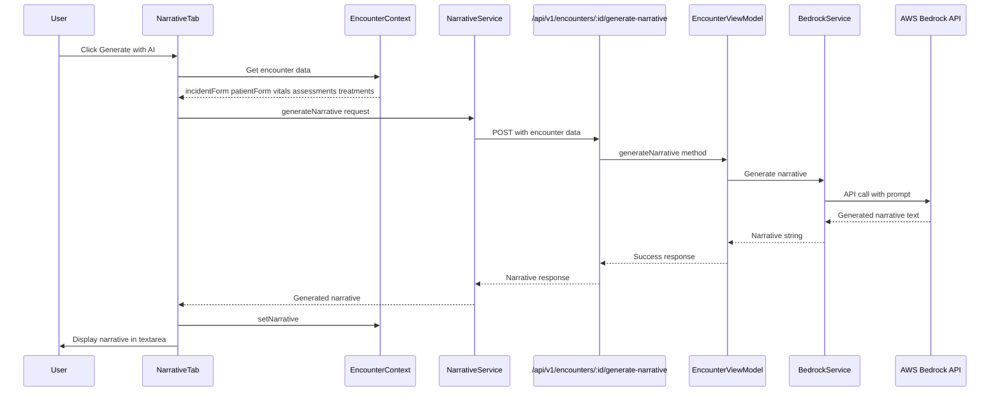

# Bedrock AI Narrative Generation Integration Analysis

**Analysis Date:** 2026-01-13  
**Prepared by:** Architect Mode  
**Status:** Analysis Complete

## Executive Summary

This document provides a comprehensive analysis of the SafeShift EHR codebase to support the integration of Amazon Bedrock API (using Claude) for auto-generating EMS narratives. The integration will add a "Generate Narrative" button to the narrative tab that generates clinical narratives from encounter data.

---

## 1. Narrative Tab Location

### Primary Component Found

**File:** [`src/app/pages/encounters/EncounterWorkspace.tsx`](../src/app/pages/encounters/EncounterWorkspace.tsx:3033)

The `NarrativeTab` component is defined as an inline function component within the EncounterWorkspace:

```typescript
// Lines 3033-3091
function NarrativeTab({
  narrativeText,
  onNarrativeChange,
}: {
  narrativeText: string;
  onNarrativeChange: (value: string) => void;
}) {
  // Uses context for persistent narrative data
  const encounterContext = useEncounter();
  const contextNarrative = encounterContext?.narrative ?? '';
  const setContextNarrative = encounterContext?.setNarrative;
  
  // ... component logic
}
```

### Current "Generate with AI" Button

The component already has a placeholder button at line 3064-3067:

```tsx
<Button size="sm" variant="outline">
  <Sparkles className="h-4 w-4 mr-2" />
  Generate with AI
</Button>
```

**Key Integration Point:** This existing button needs to be wired to the Bedrock API.

### Context State Management

**File:** [`src/app/contexts/EncounterContext.tsx`](../src/app/contexts/EncounterContext.tsx:82-83)

```typescript
narrative: string;
setNarrative: (narrative: string) => void;
```

---

## 2. Encounter Data Structure

### Frontend Context - Available Data Fields

**File:** [`src/app/contexts/EncounterContext.tsx`](../src/app/contexts/EncounterContext.tsx)

The following data is available from the encounter context for narrative generation:

| Field | Type | Source |
|-------|------|--------|
| `incidentForm` | Object | Patient contact time, clinic info, mechanism of injury, nature of illness, injury classification |
| `patientForm` | Object | Demographics (name, DOB, sex), SSN, medical history, allergies, current medications, employer |
| `vitals` | `VitalSet[]` | BP, pulse, resp, SpO2, temp, pain level, GCS, blood glucose |
| `assessments` | `Assessment[]` | Body region assessments with findings and notes |
| `treatments` | `Treatment[]` | Interventions performed with timestamps |
| `disposition` | string | Return to duty, light duty, off duty, referred, in clinic |
| `dispositionNotes` | string | Follow-up instructions |

### Patient Form Schema (Lines 120-147)

```typescript
patientForm = {
  id: string,
  firstName: string,
  lastName: string,
  dob: string,
  sex: string,
  employeeId: string,
  ssn: string,
  phone: string,
  email: string,
  streetAddress: string,
  city: string,
  state: string,
  employer: string,
  supervisorName: string,
  supervisorPhone: string,
  medicalHistory: string,
  allergies: string,
  currentMedications: string,
  pcpName: string,
  pcpPhone: string,
}
```

### Incident Form Schema (Lines 96-119)

```typescript
incidentForm = {
  mayDayTime: string,
  patientContactTime: string,
  transferOfCareTime: string,
  clearedClinicTime: string,
  clinicName: string,
  clinicStreetAddress: string,
  clinicCity: string,
  clinicState: string,
  massCasualty: 'yes' | 'no',
  location: string,
  injuryClassification: 'personal' | 'work_related',
  natureOfIllness: string,
  mechanismofinjury: string,
}
```

### Backend Encounter Entity

**File:** [`model/Entities/Encounter.php`](../model/Entities/Encounter.php)

Key fields relevant for narrative generation:

| Field | Type | Description |
|-------|------|-------------|
| `chiefComplaint` | string | Primary reason for visit |
| `hpi` | string | History of present illness |
| `ros` | string | Review of systems |
| `physicalExam` | string | Physical examination findings |
| `assessment` | string | Clinical assessment/diagnosis |
| `plan` | string | Treatment plan |
| `vitals` | array | Vital signs data |
| `clinicalData` | array | Additional clinical data |

---

## 3. API Structure Analysis

### Existing API Patterns

**Main Router:** [`api/v1/index.php`](../api/v1/index.php)

**Encounters API:** [`api/v1/encounters.php`](../api/v1/encounters.php)

#### API Route Pattern

```
GET    /api/v1/encounters              - List encounters
GET    /api/v1/encounters/:id          - Get single encounter
POST   /api/v1/encounters              - Create encounter
PUT    /api/v1/encounters/:id          - Update encounter
PUT    /api/v1/encounters/:id/submit   - Submit for review
```

#### Recommended New Endpoint

```
POST   /api/v1/encounters/:id/generate-narrative
```

### Frontend Service Pattern

**File:** [`src/app/services/encounter.service.ts`](../src/app/services/encounter.service.ts)

Follows this pattern for API calls:

```typescript
import { get, post, put } from './api.js';

const ENCOUNTER_ENDPOINTS = {
  base: '/encounters',
  byId: (id: string) => `/encounters/${id}`,
  // ... add generateNarrative endpoint
} as const;

export async function generateNarrative(id: string, data: NarrativeGenerationDTO): Promise<NarrativeResponse> {
  // API call implementation
}
```

### API Client Configuration

**File:** [`src/app/services/api.ts`](../src/app/services/api.ts)

- Base URL: `/api/v1`
- Uses Axios with CSRF protection
- Has session-based authentication
- Timeout: 30 seconds (may need to increase for AI generation)

---

## 4. Environment Configuration

### Current Environment Variables

**File:** [`.env`](../.env)

AWS Bedrock credentials are already present (lines 50-54):

```
BedrockAPIKey-artj-at-336449003773

API KEY ABSKQmVkcm9ja0FQSUtleS1hcnRqLWF0LTMzNjQ0OTAwMzc3Mzp2d2NHTUVxV2w0OTJ5MEdFZjhYV3AwbDJkVlRDNTlnWld2UEFjalJjSGE5NDJxSjZHdXNRL1RUZERjUT0=

set AWS_BEARER_TOKEN_BEDROCK=ABSKQmVkcm9ja0FQSUtleS1hcnRqLWF0LTMzNjQ0OTAwMzc3Mzp2d2NHTUVxV2w0OTJ5MEdFZjhYV3AwbDJkVlRDNTlnWld2UEFjalJjSGE5NDJxSjZHdXNRL1RUZERjUT0=
```

### Required Environment Variable Standardization

Add to `.env`:

```env
# Amazon Bedrock Configuration
AWS_BEARER_TOKEN_BEDROCK=ABSKQmVkcm9ja0FQSUtleS1hcnRqLWF0LTMzNjQ0OTAwMzc3Mzp2d2NHTUVxV2w0OTJ5MEdFZjhYV3AwbDJkVlRDNTlnWld2UEFjalJjSGE5NDJxSjZHdXNRL1RUZERjUT0=
AWS_BEDROCK_REGION=us-east-1
AWS_BEDROCK_MODEL_ID=anthropic.claude-3-sonnet-20240229-v1:0
```

---

## 5. Existing Narrative-Related Code

### Narrative Tab UI References

| File | Line | Description |
|------|------|-------------|
| [`EncounterWorkspace.tsx`](../src/app/pages/encounters/EncounterWorkspace.tsx:115) | 115 | Tab definition with label "Narrative" |
| [`EncounterWorkspace.tsx`](../src/app/pages/encounters/EncounterWorkspace.tsx:147) | 147 | Tab status tracking |
| [`EncounterWorkspace.tsx`](../src/app/pages/encounters/EncounterWorkspace.tsx:3033) | 3033 | NarrativeTab component definition |
| [`EncounterWorkspace.tsx`](../src/app/pages/encounters/EncounterWorkspace.tsx:3062) | 3062 | "Clinical Narrative" heading |
| [`EncounterWorkspace.tsx`](../src/app/pages/encounters/EncounterWorkspace.tsx:3065) | 3065 | "Generate with AI" button (placeholder) |
| [`EncounterContext.tsx`](../src/app/contexts/EncounterContext.tsx:82) | 82-83 | Narrative state management |

### AI Feature References in UI

**File:** [`src/app/pages/auth/Welcome.tsx`](../src/app/pages/auth/Welcome.tsx:164-166)

Marketing copy already mentions AI-powered narrative generation:

```
<h3 className="font-semibold mb-1">AI-Powered Narrative</h3>
<p className="text-slate-600">
  Generate clinical narratives instantly. OSHA recordability detection built-in.
</p>
```

**File:** [`src/app/pages/dashboards/SuperAdmin.tsx`](../src/app/pages/dashboards/SuperAdmin.tsx:98)

AI model entry for narrative generation already exists in mock data:

```typescript
{ id: '2', name: 'Narrative Generation', version: '1.8.2', status: 'active', accuracy: '91.7%' }
```

---

## 6. Recommended Integration Points

### A. Frontend Changes

#### 1. Add Narrative Service

**New File:** `src/app/services/narrative.service.ts`

```typescript
export interface NarrativeGenerationRequest {
  encounterId: string;
  incidentForm: IncidentForm;
  patientForm: PatientForm;
  vitals: VitalSet[];
  assessments: Assessment[];
  treatments: Treatment[];
  disposition: string;
  dispositionNotes: string;
}

export interface NarrativeGenerationResponse {
  success: boolean;
  narrative: string;
  generatedAt: string;
  modelUsed: string;
}

export async function generateNarrative(data: NarrativeGenerationRequest): Promise<NarrativeGenerationResponse>;
```

#### 2. Update NarrativeTab Component

**File:** `src/app/pages/encounters/EncounterWorkspace.tsx`

Modify the "Generate with AI" button to call the narrative service.

### B. Backend Changes

#### 1. Create Bedrock Service

**New File:** `core/Services/BedrockService.php`

```php
namespace Core\Services;

class BedrockService {
    private string $apiKey;
    private string $region;
    private string $modelId;
    
    public function generateNarrative(array $encounterData): string;
    private function buildPrompt(array $data): string;
    private function callBedrockAPI(string $prompt): string;
}
```

#### 2. Create Narrative API Endpoint

**New File:** `api/v1/narrative/generate.php`

Or add route to existing `api/v1/encounters.php`:

```php
// POST /encounters/:id/generate-narrative
if (!empty($encounterId) && $subAction === 'generate-narrative') {
    $data = getEncounterRequestBody();
    $response = $viewModel->generateNarrative($encounterId, $data);
    ApiResponse::send($response, $response['status'] ?? 200);
    return;
}
```

#### 3. Update EncounterViewModel

**File:** `ViewModel/EncounterViewModel.php`

Add method:

```php
public function generateNarrative(string $encounterId, array $data): array {
    // Validate encounter exists
    // Call BedrockService
    // Return generated narrative
}
```

---

## 7. Data Flow Diagram



---

## 8. Key Files Summary

### Frontend Files to Modify

| File | Purpose |
|------|---------|
| `src/app/pages/encounters/EncounterWorkspace.tsx` | Add click handler to Generate with AI button |
| `src/app/contexts/EncounterContext.tsx` | No changes needed - already has narrative state |

### Frontend Files to Create

| File | Purpose |
|------|---------|
| `src/app/services/narrative.service.ts` | Frontend service for narrative API calls |

### Backend Files to Create

| File | Purpose |
|------|---------|
| `core/Services/BedrockService.php` | AWS Bedrock API integration |
| `api/v1/narrative/generate.php` | OR add route to encounters.php |

### Backend Files to Modify

| File | Purpose |
|------|---------|
| `api/v1/encounters.php` | Add generate-narrative route |
| `ViewModel/EncounterViewModel.php` | Add generateNarrative method |
| `.env` | Standardize AWS_BEARER_TOKEN_BEDROCK variable |

---

## 9. Security Considerations

1. **API Key Security**: The `AWS_BEARER_TOKEN_BEDROCK` should be stored securely in `.env` and never exposed to frontend
2. **Authentication**: All narrative generation requests must be authenticated (existing auth middleware)
3. **PHI Protection**: Narrative generation requests contain PHI - ensure all logging is HIPAA compliant
4. **Rate Limiting**: Consider implementing rate limiting for AI generation calls
5. **Audit Trail**: Log all narrative generation events for compliance

---

## 10. Implementation Priority

1. **Phase 1**: Create BedrockService.php with basic API integration
2. **Phase 2**: Add API endpoint to encounters.php
3. **Phase 3**: Create narrative.service.ts frontend service
4. **Phase 4**: Wire up Generate with AI button in NarrativeTab
5. **Phase 5**: Add loading states, error handling, and user feedback
6. **Phase 6**: Testing and prompt optimization

---

## Appendix: Sample Prompt Template

For the Bedrock API, a suggested prompt template:

```
You are a clinical documentation specialist for an occupational health EMS system. Generate a professional clinical narrative based on the following encounter data.

**Patient Information:**
- Name: {firstName} {lastName}
- DOB: {dob}
- Sex: {sex}

**Incident Details:**
- Date/Time: {patientContactTime}
- Location: {location}
- Clinic: {clinicName}
- Classification: {injuryClassification}
- Mechanism of Injury: {mechanismofinjury}
- Nature of Illness: {natureOfIllness}

**Medical History:**
- History: {medicalHistory}
- Allergies: {allergies}
- Current Medications: {currentMedications}

**Vital Signs:**
{vitals formatted as table}

**Assessments:**
{assessments formatted by body region}

**Treatments/Interventions:**
{treatments formatted as list}

**Disposition:**
- Outcome: {disposition}
- Notes: {dispositionNotes}

Generate a comprehensive clinical narrative in EMS documentation style, including:
1. Chief complaint and history of present illness
2. Physical examination findings
3. Assessment and clinical impression
4. Interventions performed and patient response
5. Disposition and follow-up instructions

Use professional medical terminology while maintaining clarity.
```

---

*Document End*
