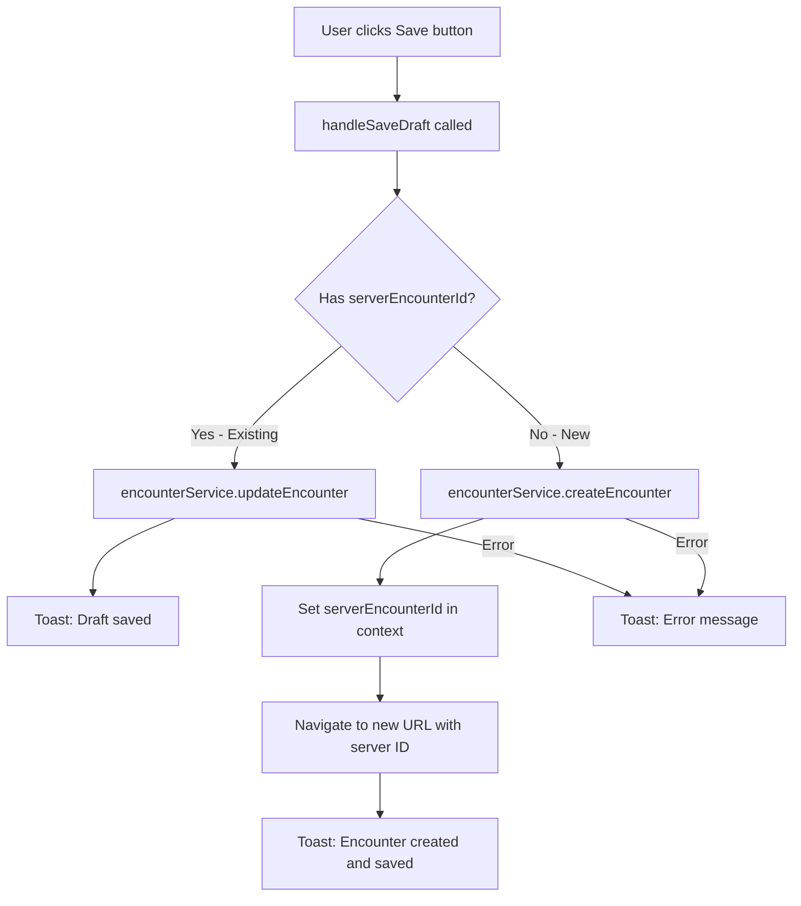
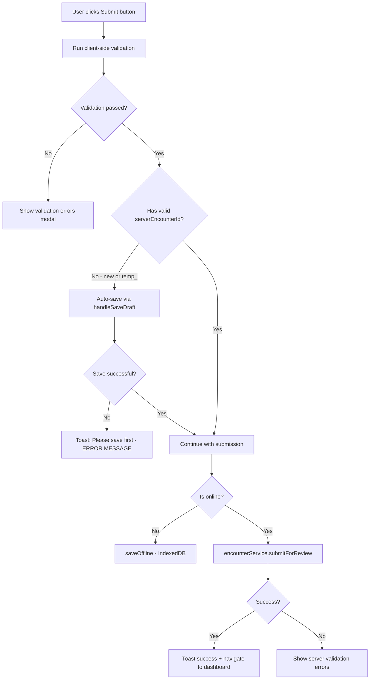
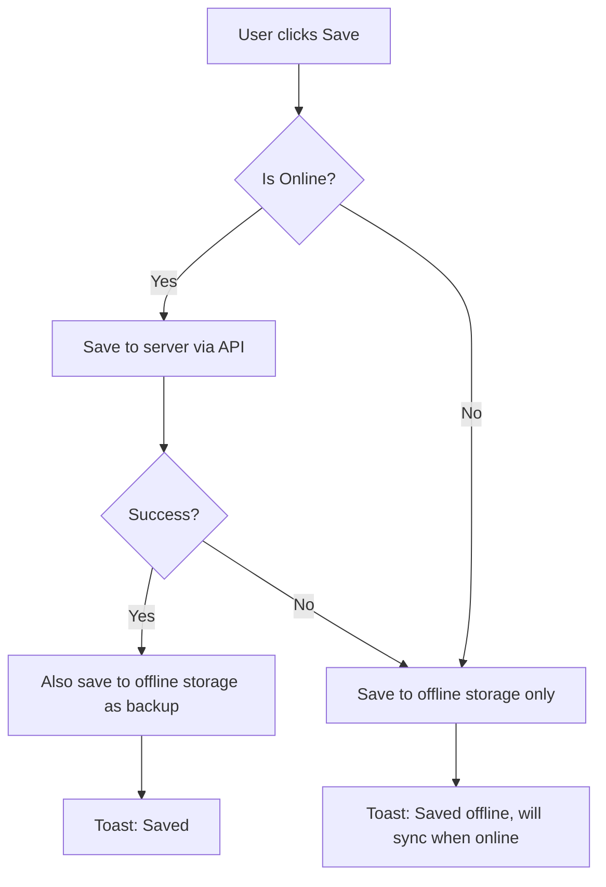
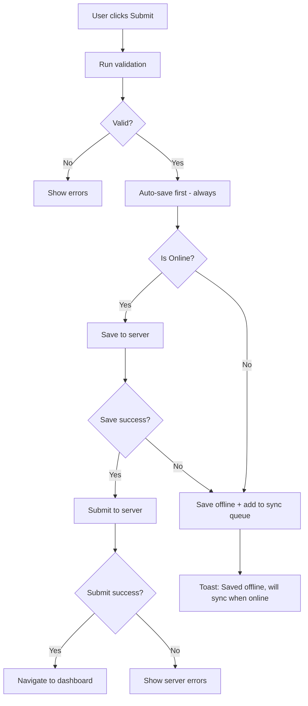
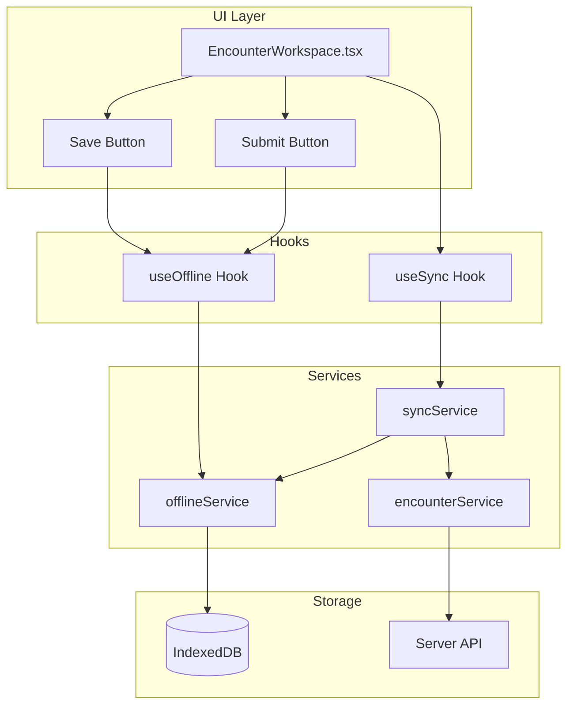

# EHR Form Save/Submit Implementation Analysis

## Overview

This document analyzes the current implementation of save and submit functionality in the EHR encounter form system, with the goal of:
1. Ensuring save functionality saves to offline storage/files
2. Integrating save into the submit button with online/offline status detection
3. Removing "save first" error messages

---

## 1. Current Save Implementation

### 1.1 Location
The save functionality is implemented in [`handleSaveDraft()`](src/app/pages/encounters/EncounterWorkspace.tsx:331) function within `EncounterWorkspace.tsx`.

### 1.2 Current Behavior



### 1.3 Key Observations

1. **Does NOT save to offline storage by default**: The current [`handleSaveDraft()`](src/app/pages/encounters/EncounterWorkspace.tsx:331) only makes API calls via `encounterService.createEncounter()` or `encounterService.updateEncounter()`.

2. **Offline save only on network error**: There's a comment at line 467-468 noting "Optionally save to offline storage here" but it's not implemented.

3. **Data Structure for Save**:
   - Patient information (firstName, lastName, dob, ssn, phone, email, address)
   - Incident information (clinicName, address, times, location, classification)
   - Clinical data (narrative, disposition, dispositionNotes)
   - Form data object containing all form states

### 1.4 Encounter Payload Structure
```typescript
const encounterPayload = {
    // Patient information - both camelCase and snake_case for backend compatibility
    patientId, patient_id,
    patientFirstName, patient_first_name,
    patientLastName, patient_last_name,
    // ... more fields
    
    // Incident information
    clinicName, clinic_name,
    clinicAddress, clinic_address,
    // ... more fields
    
    // Clinical data
    narrative, disposition, dispositionNotes,
    
    // Status
    status: 'draft',
    
    // Complete form data
    formData: {
        incidentForm,
        patientForm,
        providers,
        assessments,
        vitalsData,
        narrativeText,
        disposition,
        dispositionNotes,
        disclosureAcknowledgments,
    },
};
```

---

## 2. Current Submit Implementation

### 2.1 Location
Submit functionality is in [`handleSubmit()`](src/app/pages/encounters/EncounterWorkspace.tsx:528) function within `EncounterWorkspace.tsx`.

### 2.2 Current Flow



### 2.3 "Save First" Error Messages

**Location**: [`EncounterWorkspace.tsx:579`](src/app/pages/encounters/EncounterWorkspace.tsx:579)

```typescript
if (!serverEncounterId) {
    toast.error('Please save the encounter before submitting. Click "Save" first.');
    return;
}
```

This message appears when:
1. User clicks Submit
2. Encounter ID is 'new' or starts with 'temp_'
3. Auto-save is triggered but fails
4. No server encounter ID is obtained

---

## 3. Offline/Online Detection

### 3.1 Existing Implementation

The system has robust offline detection via the [`useOffline`](src/app/hooks/useOffline.ts) hook:

```typescript
const { isOnline, saveOffline, offlineCount, hasOfflineData } = useOffline();
```

**Features**:
- `isOnline`: Boolean tracking navigator.onLine status
- `saveOffline()`: Saves encounter data to IndexedDB
- `offlineCount`: Number of pending offline items
- `hasOfflineData`: Boolean indicating pending data exists

### 3.2 Offline Storage Service

[`offlineService`](src/app/services/offline.service.ts) provides:

- **IndexedDB Database**: 'SafeShiftEHR' with two stores:
  - `encounters`: Stores encounter data with status tracking
  - `syncQueue`: Manages sync operations with priorities

- **Data Structure**:
```typescript
{
    id: string;           // Encounter ID or temp_UUID
    tempId: string;       // Generated temp ID
    data: Record<string, unknown>;
    status: 'pending' | 'syncing' | 'synced' | 'error';
    createdAt: Date;
    updatedAt: Date;
    syncAttempts: number;
    lastError?: string;
}
```

### 3.3 Sync Service

[`syncService`](src/app/services/sync.service.ts) handles background synchronization:

- Auto-syncs when device comes online
- Manages sync queue with priorities (submit > create > update)
- Provides listener pattern for UI updates
- Shows toast notifications for sync status

---

## 4. Files That Need Modification

### 4.1 Primary Files

| File | Purpose | Changes Needed |
|------|---------|----------------|
| [`src/app/pages/encounters/EncounterWorkspace.tsx`](src/app/pages/encounters/EncounterWorkspace.tsx) | Main EHR form | Modify handleSaveDraft, handleSubmit, remove "save first" error |
| [`src/app/services/encounter.service.ts`](src/app/services/encounter.service.ts) | API calls | Potentially add offline-aware methods |

### 4.2 Supporting Files (Reference Only)

| File | Purpose | Notes |
|------|---------|-------|
| [`src/app/hooks/useOffline.ts`](src/app/hooks/useOffline.ts) | Offline detection | Already has saveOffline function |
| [`src/app/services/offline.service.ts`](src/app/services/offline.service.ts) | IndexedDB storage | Already fully implemented |
| [`src/app/services/sync.service.ts`](src/app/services/sync.service.ts) | Background sync | Already handles sync |
| [`src/app/contexts/SyncContext.tsx`](src/app/contexts/SyncContext.tsx) | Sync state | Provides useSync hook |

---

## 5. Specific Code Locations

### 5.1 Save Functionality
- **Button**: Line 821-824 - Save button in header
- **Handler**: Lines 331-492 - `handleSaveDraft()` function
- **API calls**: 
  - `encounterService.createEncounter()` - Line 437
  - `encounterService.updateEncounter()` - Line 426

### 5.2 Submit Functionality
- **Button**: Lines 825-844 - Submit button in header
- **Handler**: Lines 528-663 - `handleSubmit()` function
- **Validation**: Line 530 - `validateEncounter(encounterData)`
- **Offline save**: Line 595 - `saveOffline(submissionId, encounterData)`
- **API call**: Line 607 - `encounterService.submitForReview()`

### 5.3 Error Messages to Remove
- **Line 579**: `'Please save the encounter before submitting. Click "Save" first.'`

### 5.4 Online/Offline Detection
- **Import**: Line 3 - `useOffline` hook import
- **Usage**: Line 123 - Destructured from hook
- **Check**: Line 594 - `if (!isOnline)` check in handleSubmit

---

## 6. Recommendations for New Workflow

### 6.1 Proposed Save Flow



### 6.2 Proposed Submit Flow



### 6.3 Key Changes Required

1. **Modify `handleSaveDraft()`**:
   - Always save to offline storage (IndexedDB)
   - If online, also save to server
   - If server save fails, still keep offline copy

2. **Modify `handleSubmit()`**:
   - Remove "save first" error message entirely
   - Always auto-save before submit
   - Use isOnline check to determine server vs offline path
   - Add to sync queue if offline

3. **Submit Button Behavior**:
   - Always enabled (validation shown after click)
   - Visual indicator for online/offline status
   - Single click triggers save + submit workflow

---

## 7. Architecture Diagram



---

## 8. Summary

### Current State
- Save only goes to server API
- Submit requires server encounter ID
- "Save first" error shown if no server ID
- Offline save only used when explicitly offline during submit

### Target State
- Save always writes to IndexedDB first
- If online, also save to server
- Submit integrates auto-save
- No "save first" errors - seamless workflow
- Offline/online handled transparently

### Files to Modify
1. `src/app/pages/encounters/EncounterWorkspace.tsx` - Main changes
2. Potentially minor updates to services if needed

### Error Message to Remove
Line 579: `'Please save the encounter before submitting. Click "Save" first.'`
