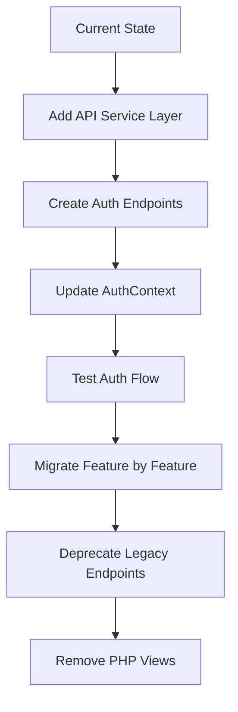

# SafeShift EHR Frontend-Backend Integration Analysis

**Document Version:** 1.0  
**Analysis Date:** 2025-12-25  
**Project Type:** HIPAA-Compliant Occupational Health EHR  
**Architecture:** PHP MVVM Backend + React 18+ Frontend

---

## Executive Summary

This document provides a comprehensive analysis of the SafeShift EHR project structure to assess integration requirements between the existing PHP MVVM backend and the newly created React 18+ frontend. The analysis reveals a mature backend infrastructure with extensive services and repositories, but significant gaps in the Model layer and frontend-backend integration.

### Key Findings

| Area | Status | Priority |
|------|--------|----------|
| `/core/` Infrastructure | ✅ Well-developed | Low |
| `/ViewModel/` Layer | ⚠️ Partially complete | Medium |
| `/model/` Domain Layer | ❌ Empty | **Critical** |
| `/api/` Router | ⚠️ Partially complete | High |
| React Contexts | ⚠️ Mock implementations | **Critical** |
| API Integration | ❌ Not implemented | **Critical** |

---

## 1. `/includes/` Directory Analysis

### 1.1 Current State

#### [`config.php`](../includes/config.php)
**Status:** Functional but needs refactoring

**Findings:**
- Contains 150+ configuration constants for database, session, security, HIPAA, MFA, etc.
- Uses conditional `define()` statements to prevent multiple inclusions
- Creates required directories dynamically (logs, uploads, sessions, cache, temp)
- Sets secure session parameters via `ini_set()`

**Issues Identified:**
1. **Security Risk:** Hardcoded credentials (DB_PASS, SMTP_PASS) should move to `.env`
2. **Duplication:** Constants like `SESSION_LIFETIME` defined in multiple files
3. **No Environment-Based Loading:** Development values hardcoded, no `.env` parsing

**Recommendation:**
```
Move to: /model/Config/AppConfig.php
Create:  /model/Config/EnvironmentLoader.php
```

#### [`bootstrap.php`](../includes/bootstrap.php)
**Status:** Well-structured

**Findings:**
- 12-step initialization process with clear documentation
- Loads config → timezone → autoloader → error handler → database → session → security headers
- Autoloader maps: `Core\` → `/core/`, `App\` → `/core/`, `ViewModel\` → `/viewmodel/`
- Backward compatibility includes for legacy files

**Issues Identified:**
1. **Namespace Inconsistency:** `App\` maps to `/core/` which is confusing
2. **No `/model/` Namespace:** Autoloader doesn't include Model namespace
3. **Session cookie_secure=true:** Will fail on HTTP development

**Recommendation:**
```
Move to:   /model/Core/Bootstrap.php
Add:       Model\ namespace mapping to /model/
Refactor:  Environment-aware session configuration
```

#### [`db.php`](../includes/db.php)
**Status:** Legacy wrapper, marked for replacement

**Findings:**
- Namespace `App\db` with three functions: `pdo()`, `checkConnection()`, `lastInsertId()`
- Static PDO singleton pattern
- Used by legacy code and some services

**Recommendation:**
```
Keep for backward compatibility until migration complete
Replace with: Core\Infrastructure\Database\DatabaseConnection (already exists)
```

#### [`header.php`](../includes/header.php)
**Status:** Legacy PHP view component

**Findings:**
- Full HTML5 header template with navigation
- Session initialization and CSRF token generation
- Security headers set via `header()` calls
- Not needed for React SPA

**Recommendation:**
```
Deprecate: Not needed for React frontend
Extract:   CSRF token logic to /model/Core/Security/CsrfTokenManager.php
```

### 1.2 Files Requiring Action

| File | Action | Target Location |
|------|--------|-----------------|
| `config.php` | Refactor | `/model/Config/AppConfig.php` |
| `bootstrap.php` | Move & Update | `/model/Core/Bootstrap.php` |
| `db.php` | Deprecate | Keep for backward compatibility |
| `header.php` | Deprecate | Extract security logic only |
| `auth.php` | Review | Merge with AuthService |
| `auth_global.php` | Review | Merge with AuthMiddleware |
| `validation.php` | Deprecate | Use `Core\Helpers\ValidationHelper` |
| `sanitization.php` | Deprecate | Use `Core\Helpers\SanitizationHelper` |

---

## 2. `/model/` Directory Analysis

### 2.1 Current State

**Status:** ❌ Nearly Empty - Critical Gap

**Contents:**
- `README.md` - Extensive MVVM documentation (566 lines)
- `.htaccess` - Security protection (deny direct access)

### 2.2 What Exists vs What's Needed

| Category | Currently Exists | Needs Creation |
|----------|------------------|----------------|
| Domain Entities | ❌ None | Patient, Encounter, User, Clinic, InjuryCase, WorkRestriction |
| Value Objects | ❌ None | SSN, PhoneNumber, EmailAddress, MRN, BloodPressure |
| Repositories | ❌ None (in /core/) | Move or mirror interfaces |
| Domain Services | ❌ None (in /core/) | OSHACaseClassifier, ReturnToWorkCalculator |
| Validators | ❌ None | EncounterValidator, WorkRestrictionPolicy |
| Interfaces | ❌ None | Repository interfaces, Service interfaces |
| Exceptions | ❌ None | Domain-specific exceptions |
| Config | ❌ None | AppConfig, DatabaseConfig, SecurityConfig |
| Core | ❌ None | Bootstrap, Container, Router |

### 2.3 Recommended Structure

```
/model/
├── Config/
│   ├── AppConfig.php           # From includes/config.php
│   ├── DatabaseConfig.php      # Database configuration
│   ├── SecurityConfig.php      # Security/HIPAA settings
│   └── EnvironmentLoader.php   # .env file parser
├── Core/
│   ├── Bootstrap.php           # From includes/bootstrap.php
│   ├── Container.php           # Dependency injection container
│   └── Router.php              # API routing (from api/index.php)
├── Entities/
│   ├── Patient.php
│   ├── Encounter.php
│   ├── User.php
│   ├── Clinic.php
│   ├── InjuryCase.php
│   └── WorkRestriction.php
├── ValueObjects/
│   ├── SSN.php
│   ├── MRN.php
│   ├── PhoneNumber.php
│   └── EmailAddress.php
├── Repositories/
│   ├── Interfaces/
│   │   ├── PatientRepositoryInterface.php
│   │   └── EncounterRepositoryInterface.php
│   └── (implementations stay in /core/Repositories/)
├── Services/
│   ├── OSHACaseClassifier.php
│   ├── ReturnToWorkCalculator.php
│   └── ComplianceChecker.php
├── Validators/
│   ├── EncounterValidator.php
│   └── WorkRestrictionPolicy.php
└── Exceptions/
    ├── InvalidEncounterStateException.php
    └── PatientNotFoundException.php
```

---

## 3. `/core/` Directory Analysis

### 3.1 Current State

**Status:** ✅ Well-developed infrastructure

### 3.2 Structure Overview

```
/core/
├── Controllers/
│   ├── BaseController.php (empty)
│   ├── Api/ (7 controllers)
│   ├── Auth/ (5 controllers)
│   ├── Dashboard/ (5 controllers)
│   └── Epcr/ (4 controllers)
├── Core/
│   ├── ApiResponse.php
│   ├── Cache.php
│   ├── Config.php
│   ├── Database.php
│   ├── Logger.php
│   ├── Session.php
│   └── Validator.php
├── Entities/ (4 entities)
│   ├── Encounter.php
│   ├── EPCR.php
│   ├── Patient.php
│   └── Vital.php
├── Exceptions/ (5 exceptions)
├── Helpers/
│   ├── 9 helper classes
│   └── DTOs/ (7 DTO classes)
├── Infrastructure/
│   ├── Database/DatabaseConnection.php
│   ├── ErrorHandling/ErrorHandler.php
│   └── Logging/ (2 loggers)
├── Interfaces/ (5 interfaces)
├── Middleware/ (6 middleware classes)
├── Repositories/ (18 repositories)
├── Services/ (30 services)
├── Traits/ (5 traits)
└── Validators/ (4 validators)
```

### 3.3 Detailed Findings

#### Controllers (21 total)
| Namespace | Files | Status |
|-----------|-------|--------|
| `Controllers/Api/` | BaseApiController (empty), 6 active | ⚠️ Incomplete |
| `Controllers/Auth/` | Login, Logout, ForgotPassword, TwoFactor, Verify | ✅ Complete |
| `Controllers/Dashboard/` | CAdmin, DClinician, 1Clinician, PClinician, TAdmin | ✅ Complete |
| `Controllers/Epcr/` | Form, Save, Submit, Validate | ✅ Complete |

#### Repositories (18 total)
**Status:** ✅ Well-implemented

Key repositories:
- `PatientRepository.php` - Patient CRUD operations
- `EncounterRepository.php` - Encounter management
- `UserRepository.php` - User/authentication data
- `EPCRRepository.php` - ePCR records
- `AuditLogRepository.php` - Audit trail
- `NotificationRepository.php` - Notifications

**Note:** Repositories are in `/core/` but per MVVM should be in `/model/`. Recommend keeping implementations here but adding interfaces in `/model/`.

#### Services (30 total)
**Status:** ✅ Comprehensive coverage

Organized by domain:
| Domain | Services |
|--------|----------|
| Authentication | AuthService |
| Patient Care | PatientService, PatientVitalsService, PatientAccessService |
| Encounters | EncounterService, EpcrService |
| Compliance | ComplianceService, OshaService, TrainingService, TrainingComplianceService |
| Operations | DashboardStatsService, InventoryService, VehicleService |
| Quality | QualityReviewService, ValidationService |
| Communication | NotificationService, EmailService |
| Reporting | ReportService, RegulatoryUpdateService |
| Logging/Audit | LogService, AuditService, PrivacyService |

#### Middleware (6 total)
**Status:** ✅ Complete

- `AuthMiddleware.php` - JWT/Session authentication
- `CorsMiddleware.php` - CORS headers
- `CsrfMiddleware.php` - CSRF protection
- `LoggingMiddleware.php` - Request logging
- `RateLimitMiddleware.php` - Rate limiting
- `ValidateJsonMiddleware.php` - JSON validation

### 3.4 Issues & Recommendations

| Issue | Impact | Recommendation |
|-------|--------|----------------|
| `BaseApiController.php` is empty | Medium | Implement shared API response methods |
| Namespace is `Core\` but also `App\` | Medium | Standardize on `Core\` namespace |
| Entities in `/core/` not `/model/` | Low | Can stay, add interfaces in `/model/` |
| `BaseRepository` creates own DB connection | Medium | Inject via constructor consistently |
| `BaseService` creates own DB connection | Medium | Use DI container |

---

## 4. `/ViewModel/` Directory Analysis

### 4.1 Current State

**Status:** ⚠️ Partially complete

**Files:**
- `ClinicianViewModel.php` (~1350 lines)
- `DashboardStatsViewModel.php` (~950 lines)
- `.htaccess` (protection)

### 4.2 ClinicianViewModel Analysis

**Namespace:** `ViewModel`

**Capabilities:**
- Session validation with timeout checking
- Role-based permission checking
- CSRF token validation and generation
- Clinical notes CRUD (stub implementations)
- ePCR CRUD (stub implementations)
- Patient records and search
- Audit event logging

**Key Methods:**
```php
validateSession(): bool
checkPermission(string $permission): bool
validateCSRFToken(string $token): bool
getClinicalNote(int $noteId): ?array
saveClinicalNote(array $data): array
getEPCR(int $epcrId): ?array
saveEPCR(array $data): array
getPatientRecord(int $patientId): ?array
searchPatients(array $criteria): array
```

**Issues:**
1. Contains many TODO markers: "Replace with actual repository call"
2. Returns mock data structures, not real database data
3. Role definitions don't match frontend (`1clinician`, `dclinician`, `pclinician` vs `provider`, `admin`)

### 4.3 DashboardStatsViewModel Analysis

**Namespace:** `ViewModel`

**Capabilities:**
- Role-based dashboard access control
- Admin dashboard data (system stats, user management, audit summary)
- Manager dashboard data (team performance, compliance, shift coverage)
- Clinician dashboard data (patient load, encounter stats, KPIs)
- Audit log retrieval and filtering
- Compliance monitoring
- QA review submission
- Regulatory update tracking

**Key Methods:**
```php
checkDashboardPermission(string $dashboardType): bool
getRoleBasedDashboard(): string
getAdminDashboardData(): array
getManagerDashboardData(): array
getClinicianDashboardData(int $userId): array
getAuditLogs(array $filters): array
getComplianceData(): array
getQAReviewData(array $filters): array
submitQAReview(array $data): array
getRegulatoryUpdates(): array
```

**Issues:**
1. Most methods return mock data (TODO markers)
2. Has optional DashboardStatsService dependency but doesn't always use it
3. Permission mapping uses legacy role names

### 4.4 Needed ViewModels

| ViewModel | Purpose | Priority |
|-----------|---------|----------|
| `AuthViewModel.php` | Login, 2FA, session management | **Critical** |
| `PatientViewModel.php` | Patient CRUD for React | High |
| `EncounterViewModel.php` | Encounter management | High |
| `NotificationViewModel.php` | Notifications for React | Medium |
| `SettingsViewModel.php` | User preferences | Medium |
| `ShiftViewModel.php` | Shift management | Medium |

---

## 5. `/api/` Directory Analysis

### 5.1 Current State

**Status:** ⚠️ Partially complete

### 5.2 File Structure

```
/api/
├── index.php              # Central router
├── middleware/
│   └── rate-limit.php     # Rate limiting
├── ems/
│   ├── save-epcr.php
│   ├── submit-epcr.php
│   └── validate-epcr.php
└── (12 legacy endpoints)
    ├── encounter-save-hook.php
    ├── flags.php
    ├── log-details.php
    ├── log-files.php
    ├── log-patient-access.php
    ├── log-stats.php
    ├── log.php
    ├── logs.php
    ├── notifications.php
    ├── patient-vitals.php
    ├── qa-review.php
    ├── recent-patients.php
    ├── regulatory-updates.php
    ├── resend-otp.php
    ├── sync.php
    ├── templates.php
    ├── test.php
    ├── tooltips.php
    ├── training-compliance.php
    └── verify-integrity.php
```

### 5.3 Central Router Analysis (`index.php`)

**Capabilities:**
- JSON response headers
- CORS handling (same-origin only)
- Session validation (requires authenticated user)
- CSRF validation for POST/PUT/DELETE/PATCH
- Rate limiting per endpoint
- Input sanitization
- Routing to ViewModels with dependency injection

**Current Routes:**
| Endpoint | Method | ViewModel | Status |
|----------|--------|-----------|--------|
| `dashboard-stats` | GET | DashboardStatsViewModel | ✅ Implemented |
| `recent-patients` | GET | RecentPatientsViewModel | ⚠️ Missing ViewModel |
| `patient-vitals` | GET | PatientVitalsViewModel | ⚠️ Missing ViewModel |
| `notifications` | GET/POST | NotificationsViewModel | ⚠️ Missing ViewModel |
| `ems/*` | POST/GET | EPCRViewModel | ⚠️ Missing ViewModel |

**Issues:**
1. References ViewModels that don't exist (`RecentPatientsViewModel`, `PatientVitalsViewModel`, `NotificationsViewModel`, `EPCRViewModel`)
2. No authentication endpoints (login, logout, 2FA)
3. Many legacy endpoints not integrated into router
4. No versioning (should be `/api/v1/`)
5. No OpenAPI/Swagger documentation

### 5.4 Required API Endpoints for React

| Endpoint | Method | Purpose | Priority |
|----------|--------|---------|----------|
| `/api/v1/auth/login` | POST | User authentication | **Critical** |
| `/api/v1/auth/logout` | POST | Session termination | **Critical** |
| `/api/v1/auth/2fa/verify` | POST | 2FA verification | **Critical** |
| `/api/v1/auth/2fa/resend` | POST | Resend OTP | High |
| `/api/v1/auth/session` | GET | Session validation | **Critical** |
| `/api/v1/auth/csrf` | GET | Get CSRF token | **Critical** |
| `/api/v1/users/me` | GET | Current user profile | High |
| `/api/v1/users/me/role` | PUT | Switch active role | High |
| `/api/v1/patients` | GET/POST | Patient list/create | High |
| `/api/v1/patients/{id}` | GET/PUT | Patient details | High |
| `/api/v1/encounters` | GET/POST | Encounter list/create | High |
| `/api/v1/encounters/{id}` | GET/PUT | Encounter details | High |
| `/api/v1/shift` | GET/POST/PUT | Shift management | Medium |
| `/api/v1/notifications` | GET | User notifications | Medium |
| `/api/v1/notifications/read` | POST | Mark as read | Medium |
| `/api/v1/sync` | POST | Offline sync | Medium |

---

## 6. `/src/` (React Frontend) Analysis

### 6.1 Current State

**Status:** ⚠️ UI complete, API integration missing

### 6.2 Structure Overview

```
/src/
├── main.tsx                    # Entry point
├── app/
│   ├── App.tsx                 # Root component with routing
│   ├── components/
│   │   ├── ErrorBoundary.tsx
│   │   ├── assessments/        # 10 assessment components
│   │   ├── encounter/          # Encounter navigation
│   │   ├── figma/              # Image components
│   │   ├── layout/             # DashboardLayout
│   │   ├── shift/              # Shift modal
│   │   └── ui/                 # 40+ shadcn/ui components
│   ├── contexts/
│   │   ├── AuthContext.tsx     # Mock auth
│   │   ├── DarkModeContext.tsx
│   │   ├── EncounterContext.tsx
│   │   ├── ShiftContext.tsx
│   │   └── SyncContext.tsx     # Mock sync
│   ├── pages/
│   │   ├── auth/               # Login, TwoFactor, Welcome, Setup
│   │   ├── dashboards/         # 10 role-based dashboards
│   │   ├── encounters/         # StartEncounter, EncounterWorkspace
│   │   ├── feedback/           # Ticket, Bug, Feature
│   │   └── settings/           # Settings page
│   └── types/
│       └── index.ts            # Type definitions
└── styles/
    ├── index.css
    ├── tailwind.css
    └── theme.css
```

### 6.3 Context Analysis

#### AuthContext.tsx
**Status:** ❌ Mock implementation

```typescript
// Current implementation
const login = async (email: string, password: string) => {
  // Mock login - in real app would call API
  setRequires2FA(true);
};

const verify2FA = async (code: string) => {
  // Mock 2FA verification
  const mockUser: User = { ... };
  setUser(mockUser);
};
```

**Issues:**
1. Uses localStorage for auth state (acceptable for session, not for tokens)
2. No real API calls
3. No CSRF token handling
4. No token refresh mechanism
5. No error handling

**Required Changes:**
```typescript
// Needed implementation
const login = async (email: string, password: string) => {
  const response = await fetch('/api/v1/auth/login', {
    method: 'POST',
    headers: {
      'Content-Type': 'application/json',
      'X-CSRF-Token': csrfToken,
    },
    credentials: 'include',
    body: JSON.stringify({ email, password }),
  });
  // Handle response...
};
```

#### SyncContext.tsx
**Status:** ⚠️ Partial implementation

**Findings:**
- Tracks online/offline status correctly
- Queue management implemented
- Actual sync (API calls) not implemented

#### ShiftContext.tsx
**Status:** ⚠️ Local-only

**Findings:**
- Manages shift state correctly
- Persists to localStorage
- No backend integration

### 6.4 Type Definitions Analysis

**File:** `src/app/types/index.ts`

**Current Types:**
```typescript
export type UserRole = 'provider' | 'registration' | 'admin' | 'super-admin';

export interface User {
  id: string;
  name: string;
  email: string;
  roles: UserRole[];
  currentRole: UserRole;
  deviceId?: string;
  trustedDevice: boolean;
  avatar?: string;
}
```

**Backend Roles (from PHP):**
```php
// ClinicianViewModel
private const ALLOWED_ROLES = ['1clinician', 'dclinician', 'pclinician', 'cadmin', 'tadmin'];

// DashboardStatsViewModel
const DASHBOARD_PERMISSIONS = [
  'admin' => ['Admin', 'cadmin', 'tadmin'],
  'manager' => ['Manager', 'Admin', 'dclinician'],
  'clinician' => ['1clinician', 'dclinician', 'pclinician', 'Admin', 'Manager'],
  // ...
];
```

**⚠️ CRITICAL MISMATCH:** Frontend roles don't match backend roles!

**Required Type Updates:**
```typescript
export type UserRole = 
  | '1clinician'      // 1st Responder Clinician
  | 'dclinician'      // Doctor Clinician
  | 'pclinician'      // Privacy Clinician
  | 'cadmin'          // Clinic Admin
  | 'tadmin'          // Tech Admin
  | 'Employee'        // Employee
  | 'Employer'        // Employer Portal
  | 'Manager'         // Manager
  | 'QA'              // QA Reviewer
  | 'Admin';          // System Admin
```

### 6.5 Missing React Infrastructure

| Component | Purpose | Priority |
|-----------|---------|----------|
| `src/app/services/api.ts` | Centralized API client | **Critical** |
| `src/app/services/auth.ts` | Auth API functions | **Critical** |
| `src/app/hooks/useApi.ts` | API request hook | High |
| `src/app/hooks/useCsrf.ts` | CSRF token management | **Critical** |
| `src/app/utils/storage.ts` | Secure storage helpers | Medium |
| `src/app/types/api.ts` | API response types | High |
| `src/app/contexts/ApiContext.tsx` | API client context | High |

---

## 7. Integration Gap Analysis

### 7.1 Critical Gaps

| Gap | Impact | Resolution |
|-----|--------|------------|
| No API client in React | Cannot communicate with backend | Create `src/app/services/api.ts` |
| Role name mismatch | Auth will fail | Align type definitions |
| Missing auth endpoints | Cannot login | Create `/api/v1/auth/*` routes |
| Empty `/model/` directory | No domain layer | Create domain entities |
| Mock ViewModels | No real data | Connect to repositories |
| No CSRF in React | POST requests will fail | Add CSRF token handling |

### 7.2 Data Flow Issues

```
Current State:
React App → [MOCK DATA] → Display

Required State:
React App → API Service → PHP Router → ViewModel → Service → Repository → Database
                                                                          ↓
React App ← [JSON Response] ← PHP Router ← ViewModel ← Service ← Repository ←
```

### 7.3 Authentication Flow Gap

```
Required Auth Flow:
1. React: POST /api/v1/auth/login
2. PHP: Validate credentials
3. PHP: Generate OTP, send via email
4. PHP: Return requires2FA: true
5. React: POST /api/v1/auth/2fa/verify
6. PHP: Validate OTP
7. PHP: Create session, return user + CSRF token
8. React: Store session, navigate to dashboard
```

**Currently Missing:**
- Steps 1-7 not implemented
- No session cookie configuration for SPA
- No CSRF token endpoint

---

## 8. Recommended Implementation Order

### Phase 1: Foundation (Critical)

1. **Create API Service Layer in React**
   - `src/app/services/api.ts` - Base API client
   - `src/app/hooks/useCsrf.ts` - CSRF management
   - Error handling utilities

2. **Create Auth API Endpoints**
   - `/api/v1/auth/login`
   - `/api/v1/auth/2fa/verify`
   - `/api/v1/auth/session`
   - `/api/v1/auth/csrf`

3. **Create AuthViewModel.php**
   - Login validation
   - 2FA verification
   - Session management

4. **Update React AuthContext**
   - Replace mock with real API calls
   - Handle session cookies
   - CSRF token integration

### Phase 2: Core Domain (High)

5. **Create `/model/` Directory Structure**
   - Config classes
   - Entity interfaces
   - Repository interfaces

6. **Align Role Types**
   - Update `src/app/types/index.ts`
   - Map frontend roles to backend

7. **Connect ViewModels to Repositories**
   - Replace TODO stubs with real calls
   - Add error handling

### Phase 3: Feature Integration (Medium)

8. **Patient Management**
   - Create PatientViewModel
   - Add API endpoints
   - Update React pages

9. **Encounter Management**
   - Create EncounterViewModel
   - Add API endpoints
   - Update React pages

10. **Shift Management**
    - Create ShiftViewModel
    - Add API endpoints
    - Update ShiftContext

### Phase 4: Polish (Low)

11. **Offline Sync**
    - Implement real sync in SyncContext
    - Add sync endpoint

12. **Notifications**
    - Create NotificationsViewModel
    - WebSocket or polling

---

## 9. Potential Conflicts & Breaking Changes

### 9.1 Breaking Changes Required

| Change | Files Affected | Risk |
|--------|----------------|------|
| Role type rename | All dashboard components, AuthContext | Medium |
| API response structure | All React fetch calls | High |
| Session cookie config | bootstrap.php, vite.config.ts | Medium |
| CORS configuration | api/index.php | Low |

### 9.2 Backward Compatibility Concerns

1. **Legacy PHP Pages:** Some PHP pages may still use `$_SESSION['user']` format. Ensure session structure remains compatible.

2. **Existing API Endpoints:** Legacy endpoints in `/api/` should remain functional until React migration complete.

3. **Database Schema:** No changes required to database structure.

### 9.3 Migration Strategy



---

## 10. Files Requiring Modification

### 10.1 PHP Files to Modify

| File | Modification |
|------|--------------|
| `api/index.php` | Add auth routes, versioning |
| `includes/bootstrap.php` | Update session config for SPA |
| `includes/config.php` | Move secrets to .env |
| `ViewModel/ClinicianViewModel.php` | Connect to repositories |
| `ViewModel/DashboardStatsViewModel.php` | Connect to repositories |

### 10.2 PHP Files to Create

| File | Purpose |
|------|---------|
| `ViewModel/AuthViewModel.php` | Authentication handling |
| `ViewModel/PatientViewModel.php` | Patient management |
| `ViewModel/EncounterViewModel.php` | Encounter management |
| `ViewModel/ShiftViewModel.php` | Shift management |
| `model/Config/AppConfig.php` | Configuration class |
| `model/Core/Bootstrap.php` | Bootstrapper class |

### 10.3 React Files to Modify

| File | Modification |
|------|--------------|
| `src/app/contexts/AuthContext.tsx` | Add real API calls |
| `src/app/contexts/SyncContext.tsx` | Add real sync logic |
| `src/app/contexts/ShiftContext.tsx` | Add API integration |
| `src/app/types/index.ts` | Update role types |

### 10.4 React Files to Create

| File | Purpose |
|------|---------|
| `src/app/services/api.ts` | API client |
| `src/app/services/auth.ts` | Auth functions |
| `src/app/hooks/useCsrf.ts` | CSRF management |
| `src/app/hooks/useApi.ts` | API hook |
| `src/app/types/api.ts` | API types |

---

## 11. Summary

### Strengths
- ✅ Comprehensive PHP service and repository layer
- ✅ Well-structured React component library
- ✅ Good security middleware in place
- ✅ Extensive ViewModel documentation

### Weaknesses
- ❌ Empty `/model/` domain layer
- ❌ No API integration in React
- ❌ Role type mismatch
- ❌ Mock implementations in contexts

### Next Steps
1. Create API service layer in React
2. Implement auth endpoints in PHP
3. Create AuthViewModel
4. Update AuthContext with real API calls
5. Align role types between frontend and backend

---

**Document Prepared By:** Integration Analysis System  
**Last Updated:** 2025-12-25
