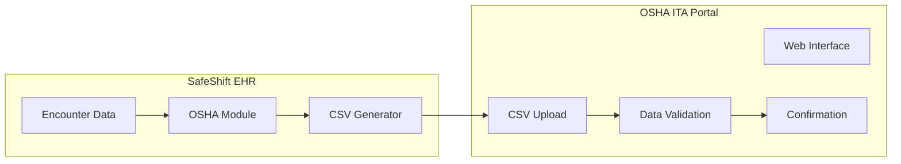
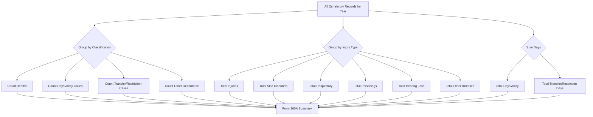
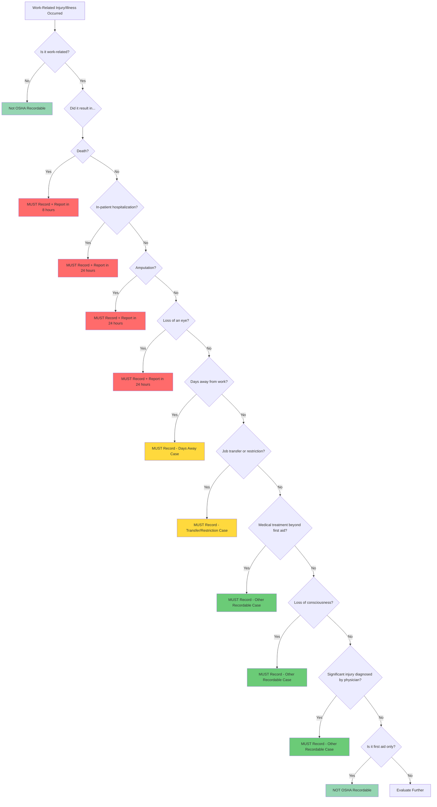
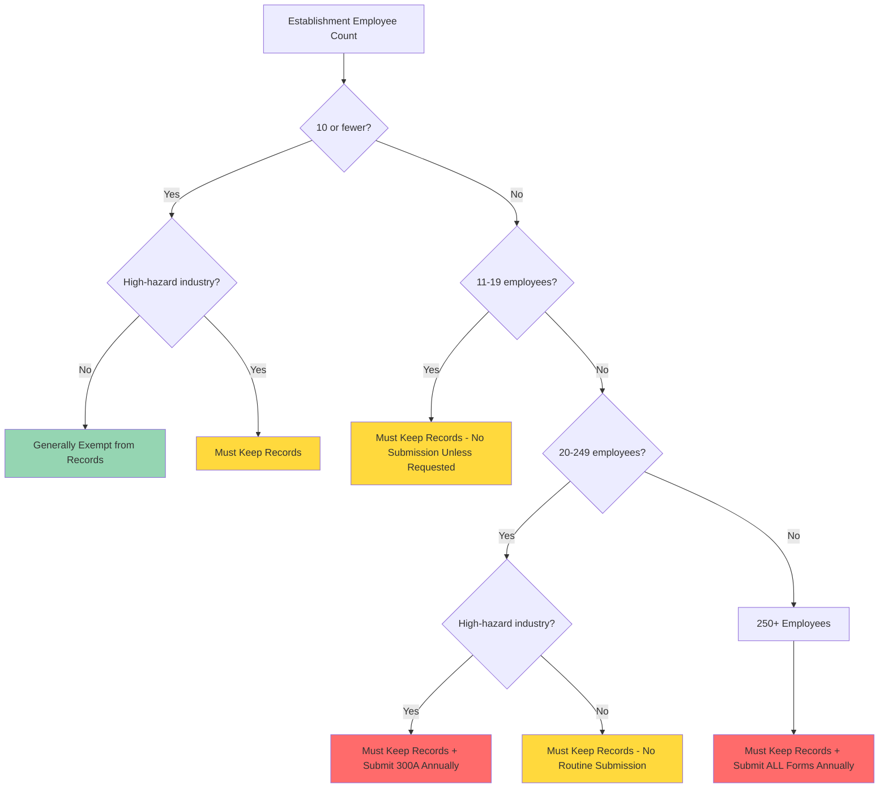
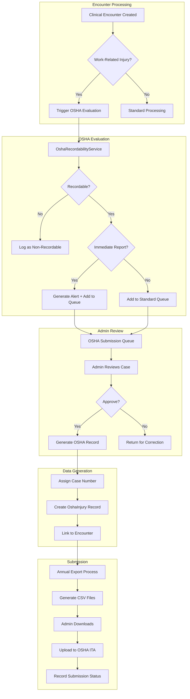
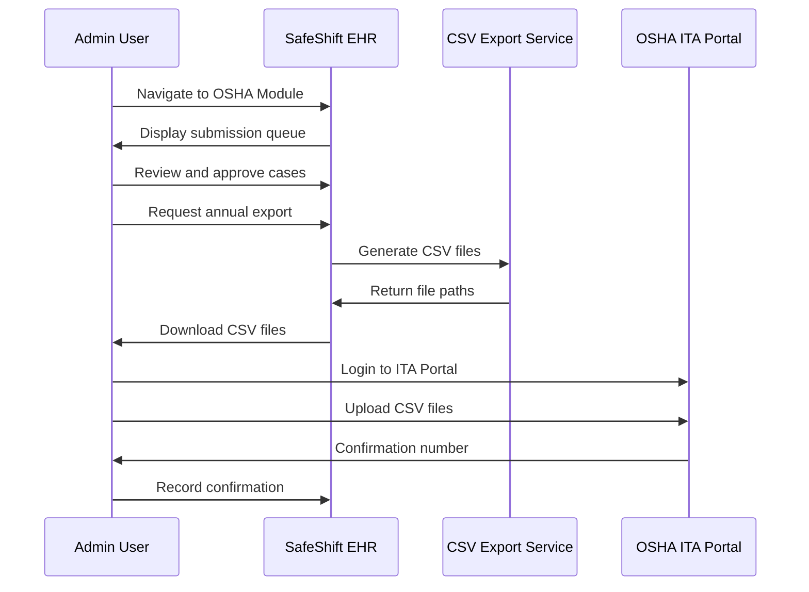
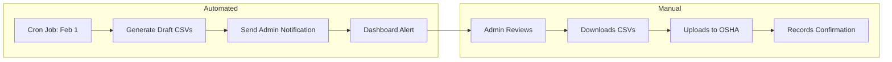
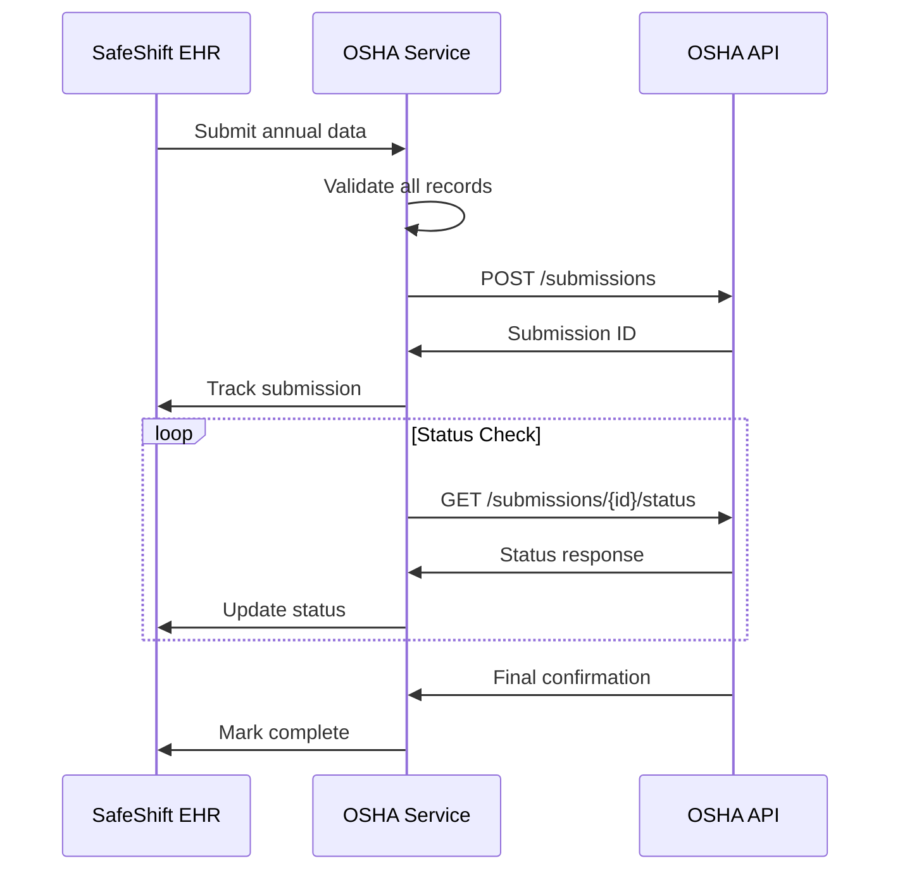
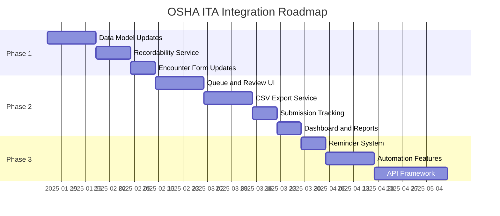

# OSHA ITA Integration Architecture

## SafeShift EHR - OSHA Injury Tracking Application Integration

**Document Version**: 1.0  
**Last Updated**: December 28, 2025  
**Status**: Architecture Planning  
**Author**: SafeShift Development Team

---

## Table of Contents

1. [OSHA ITA Overview](#1-osha-ita-overview)
2. [API Research and Submission Methods](#2-api-research-and-submission-methods)
3. [Data Mapping](#3-data-mapping)
4. [Submission Logic Rules](#4-submission-logic-rules)
5. [Establishment Requirements](#5-establishment-requirements)
6. [Technical Architecture](#6-technical-architecture)
7. [Integration Approaches](#7-integration-approaches)
8. [Security and Compliance](#8-security-and-compliance)
9. [Implementation Roadmap](#9-implementation-roadmap)
10. [References](#10-references)

---

## 1. OSHA ITA Overview

### 1.1 What is the OSHA Injury Tracking Application (ITA)?

The **OSHA Injury Tracking Application (ITA)** is a web-based electronic reporting system maintained by the Occupational Safety and Health Administration (OSHA). It enables employers to submit workplace injury and illness data electronically as required by 29 CFR Part 1904.

Key aspects:
- **Portal URL**: https://www.osha.gov/injuryreporting/
- **Purpose**: Collect, aggregate, and analyze workplace injury/illness data nationally
- **Mandate**: Electronic submission required for covered establishments
- **Data Published**: OSHA publishes aggregated data publicly for research and enforcement

### 1.2 Purpose and Regulatory Requirements

The electronic reporting requirements stem from the **Improve Tracking of Workplace Injuries and Illnesses** final rule (29 CFR 1904.41), which aims to:

1. **Improve injury data accuracy** through standardized electronic collection
2. **Enable proactive enforcement** by identifying high-hazard workplaces
3. **Promote workplace safety** through public data access
4. **Reduce reporting burden** for large employers with automated systems

> **⚖️ LEGAL/COMPLIANCE REVIEW REQUIRED**: Confirm current regulatory requirements as OSHA rules may have been updated since this document was created.

### 1.3 Who Must Submit

#### Establishment Size Requirements

| Employee Count | Form 300A | Forms 300/301 | Electronic Submission |
|----------------|-----------|---------------|----------------------|
| 1-10 employees | Generally exempt* | Exempt | Not required |
| 11-19 employees | Must maintain | Must maintain | Only if requested |
| 20-249 employees | Must maintain | Must maintain | Form 300A annually (if high-hazard industry) |
| 250+ employees | Must maintain | Must maintain | All forms annually |

*\*Exemptions do not apply if establishment is in a high-hazard industry or OSHA specifically requests records.*

#### High-Hazard Industries (NAICS Codes)

Establishments with **20-249 employees** must submit Form 300A if in designated high-hazard industries:

```
Manufacturing (31-33)
Utilities (22)
Construction (23)
Wholesale Trade (42)
Transportation and Warehousing (48-49)
Healthcare and Social Assistance (62)
Agriculture, Forestry, Fishing and Hunting (11)
Mining, Quarrying, Oil and Gas Extraction (21)
```

> **📋 BUSINESS DECISION REQUIRED**: Determine which NAICS codes apply to SafeShift client establishments.

### 1.4 Submission Deadlines

| Form | Deadline | Notes |
|------|----------|-------|
| **Form 300A** | March 2nd | Annual summary for previous calendar year |
| **Form 300** | March 2nd | Log entries (250+ employees only) |
| **Form 301** | March 2nd | Incident reports (250+ employees only) |

**Special Reporting Requirements**:
- **Fatality**: Report within **8 hours** via phone (1-800-321-OSHA) or online
- **Hospitalization, Amputation, Eye Loss**: Report within **24 hours**

---

## 2. API Research and Submission Methods

### 2.1 OSHA ITA System Architecture

The OSHA ITA system is primarily a **web portal** with **CSV bulk upload** capabilities. As of 2025, OSHA does not provide a public REST API for automated submissions.



### 2.2 Available Submission Methods

#### Method 1: Manual Web Entry
- Direct entry into ITA web forms
- Suitable for: Small establishments with few cases
- Pros: No technical setup required
- Cons: Time-consuming, error-prone for large volumes

#### Method 2: CSV Bulk Upload (Recommended)
- Upload formatted CSV files through ITA portal
- Suitable for: Medium to large establishments
- Pros: Batch processing, reduces manual entry errors
- Cons: Still requires manual upload step

#### Method 3: API Integration (Future)
- Direct system-to-system submission
- Status: **Not currently available from OSHA**
- Note: OSHA has indicated plans for API access but no timeline confirmed

> **🔍 FURTHER API RESEARCH REQUIRED**: Monitor OSHA announcements for API availability. Check https://www.osha.gov/injuryreporting/ita/ periodically.

### 2.3 CSV File Specifications

#### Form 300A CSV Template

| Column | Field Name | Required | Format | Max Length |
|--------|------------|----------|--------|------------|
| A | Establishment Name | Yes | Text | 100 |
| B | Street Address | Yes | Text | 100 |
| C | City | Yes | Text | 50 |
| D | State | Yes | 2-letter code | 2 |
| E | ZIP Code | Yes | 5 or 9 digits | 10 |
| F | NAICS Code | Yes | 6 digits | 6 |
| G | Annual Average Employees | Yes | Integer | 10 |
| H | Total Hours Worked | Yes | Decimal | 15 |
| I | Total Deaths | Yes | Integer | 5 |
| J | Total Cases with Days Away | Yes | Integer | 5 |
| K | Total Cases with Transfer/Restriction | Yes | Integer | 5 |
| L | Total Other Recordable Cases | Yes | Integer | 5 |
| M | Total Days Away from Work | Yes | Integer | 6 |
| N | Total Days of Transfer/Restriction | Yes | Integer | 6 |
| O | Total Injuries | Yes | Integer | 5 |
| P | Total Skin Disorders | Yes | Integer | 5 |
| Q | Total Respiratory Conditions | Yes | Integer | 5 |
| R | Total Poisonings | Yes | Integer | 5 |
| S | Total Hearing Loss | Yes | Integer | 5 |
| T | Total All Other Illnesses | Yes | Integer | 5 |
| U | Certification Date | Yes | MM/DD/YYYY | 10 |
| V | Certifying Officer Name | Yes | Text | 100 |
| W | Certifying Officer Title | Yes | Text | 50 |

#### Form 300 Log CSV Template

| Column | Field Name | Required | Format |
|--------|------------|----------|--------|
| A | Case Number | Yes | Integer |
| B | Employee Name* | Conditional | Text |
| C | Job Title | Yes | Text |
| D | Date of Injury/Illness | Yes | MM/DD/YYYY |
| E | Where Event Occurred | Yes | Text |
| F | Description | Yes | Text |
| G | Classify: Death | Yes | X or blank |
| H | Classify: Days Away | Yes | X or blank |
| I | Classify: Job Transfer/Restriction | Yes | X or blank |
| J | Classify: Other Recordable | Yes | X or blank |
| K | Days Away from Work | Conditional | Integer |
| L | Days of Transfer/Restriction | Conditional | Integer |
| M | Injury | Yes | X or blank |
| N | Skin Disorder | Yes | X or blank |
| O | Respiratory Condition | Yes | X or blank |
| P | Poisoning | Yes | X or blank |
| Q | Hearing Loss | Yes | X or blank |
| R | All Other Illnesses | Yes | X or blank |

*\*Privacy cases (sexual assault, HIV, mental illness, needlestick) enter "Privacy Case" instead of name*

#### Form 301 Incident Report CSV Template

| Column | Field Name | Required | Format |
|--------|------------|----------|--------|
| A | Case Number | Yes | Integer |
| B | Employee Full Name | Yes | Text |
| C | Employee Street Address | Yes | Text |
| D | Employee City | Yes | Text |
| E | Employee State | Yes | 2-letter |
| F | Employee ZIP | Yes | Text |
| G | Date of Birth | Yes | MM/DD/YYYY |
| H | Date Hired | Yes | MM/DD/YYYY |
| I | Employee Sex | Yes | M/F |
| J | Physician Name | Conditional | Text |
| K | Facility Name (if treatment) | Conditional | Text |
| L | Facility Street Address | Conditional | Text |
| M | Facility City | Conditional | Text |
| N | Facility State | Conditional | 2-letter |
| O | Facility ZIP | Conditional | Text |
| P | Emergency Room Visit | Yes | Y/N |
| Q | Hospitalized Overnight | Yes | Y/N |
| R | Date of Injury/Illness | Yes | MM/DD/YYYY |
| S | Time Employee Began Work | Yes | HH:MM AM/PM |
| T | Time of Event | Yes | HH:MM AM/PM |
| U | What Was Employee Doing | Yes | Text (500) |
| V | What Happened | Yes | Text (500) |
| W | What Was the Injury/Illness | Yes | Text (500) |
| X | What Object/Substance Harmed | Yes | Text (200) |
| Y | Date of Death (if applicable) | Conditional | MM/DD/YYYY |

---

## 3. Data Mapping

### 3.1 Existing SafeShift EHR OSHA Data Model

SafeShift EHR already includes an `OshaInjury` entity at [`model/Entities/OshaInjury.php`](../model/Entities/OshaInjury.php) with the following structure:

```php
// Core Identification
$caseId          // UUID - Internal case identifier
$encounterId     // UUID - Related clinical encounter
$patientId       // UUID - Employee/Patient identifier
$caseNumber      // Integer - OSHA 300 log case number
$logYear         // Integer - Year for OSHA 300 log

// Employee Information
$employeeName    // String - Employee full name
$jobTitle        // String - Job title at time of injury

// Establishment Information
$establishmentId   // UUID - Employer establishment
$establishmentName // String - Establishment name

// Injury Details
$injuryDate      // DateTime - Date of injury/illness
$location        // String - Where event occurred
$description     // String - Description of injury/illness
$howOccurred     // String - How the injury occurred

// Classification
$classification  // Enum: death, days_away, job_transfer_restriction, other_recordable
$isRecordable    // Boolean - Is OSHA recordable

// Outcome Tracking
$resultedInDeath           // Boolean
$deathDate                 // DateTime
$daysAwayFromWork          // Boolean
$daysAwayCount             // Integer
$jobTransferRestriction    // Boolean
$jobTransferRestrictionDays // Integer
$otherRecordable           // Boolean

// Injury Type (Form 300 Column M-R)
$injuryType      // Enum: injury, skin_disorder, respiratory, poisoning, hearing_loss, all_other
$bodyPart        // String - Body part affected
$sourceOfInjury  // String - Object/substance
$eventType       // String - Event type

// Special Categories
$isPrivacyCase        // Boolean - Column B privacy case
$hearingLoss          // Boolean
$needlestickSharps    // Boolean
$skinDisorder         // Boolean
$respiratoryCondition // Boolean
$poisoning            // Boolean
$otherIllness         // Boolean

// Treatment Information
$initialTreatment    // String
$treatingPhysician   // String
$hospital            // String
$wasHospitalized     // Boolean
$returnToWorkDate    // DateTime

// Administrative
$status              // Enum: open, closed, pending_review, amended
$workersCompClaimNumber // String
```

### 3.2 Form 300 Field Mapping

| OSHA Form 300 Field | SafeShift EHR Field | Source |
|---------------------|---------------------|--------|
| Case No. | `OshaInjury.caseNumber` | Auto-generated |
| Employee Name | `OshaInjury.employeeName` | Patient entity |
| Job Title | `OshaInjury.jobTitle` | Encounter/Employment |
| Date of Injury | `OshaInjury.injuryDate` | Encounter date |
| Where Event Occurred | `OshaInjury.location` | Encounter clinical data |
| Description | `OshaInjury.description` | Encounter assessment |
| Death | `OshaInjury.resultedInDeath` | Classification |
| Days Away | `OshaInjury.daysAwayFromWork` | Classification |
| Job Transfer/Restriction | `OshaInjury.jobTransferRestriction` | Classification |
| Other Recordable | `OshaInjury.otherRecordable` | Classification |
| Days Away Count | `OshaInjury.daysAwayCount` | Manual entry |
| Transfer/Restriction Days | `OshaInjury.jobTransferRestrictionDays` | Manual entry |
| Injury (Col M) | `OshaInjury.injuryType == 'injury'` | Classification |
| Skin Disorder (Col N) | `OshaInjury.skinDisorder` | Classification |
| Respiratory (Col O) | `OshaInjury.respiratoryCondition` | Classification |
| Poisoning (Col P) | `OshaInjury.poisoning` | Classification |
| Hearing Loss (Col Q) | `OshaInjury.hearingLoss` | Classification |
| All Other Illnesses (Col R) | `OshaInjury.otherIllness` | Classification |

### 3.3 Form 300A Summary Mapping

Form 300A requires aggregated totals from Form 300 entries:



**SQL Query for 300A Generation**:

```sql
SELECT 
    establishment_id,
    log_year,
    -- Classification totals
    SUM(CASE WHEN resulted_in_death = 1 THEN 1 ELSE 0 END) AS total_deaths,
    SUM(CASE WHEN classification = 'days_away' THEN 1 ELSE 0 END) AS total_days_away_cases,
    SUM(CASE WHEN classification = 'job_transfer_restriction' THEN 1 ELSE 0 END) AS total_transfer_cases,
    SUM(CASE WHEN classification = 'other_recordable' THEN 1 ELSE 0 END) AS total_other_recordable,
    -- Days totals
    SUM(days_away_count) AS total_days_away,
    SUM(job_transfer_restriction_days) AS total_transfer_days,
    -- Injury type totals
    SUM(CASE WHEN injury_type = 'injury' THEN 1 ELSE 0 END) AS total_injuries,
    SUM(CASE WHEN skin_disorder = 1 THEN 1 ELSE 0 END) AS total_skin_disorders,
    SUM(CASE WHEN respiratory_condition = 1 THEN 1 ELSE 0 END) AS total_respiratory,
    SUM(CASE WHEN poisoning = 1 THEN 1 ELSE 0 END) AS total_poisonings,
    SUM(CASE WHEN hearing_loss = 1 THEN 1 ELSE 0 END) AS total_hearing_loss,
    SUM(CASE WHEN other_illness = 1 THEN 1 ELSE 0 END) AS total_other_illnesses
FROM osha_injuries
WHERE is_recordable = 1
    AND log_year = :year
GROUP BY establishment_id, log_year;
```

### 3.4 Form 301 Field Mapping

| OSHA Form 301 Field | SafeShift EHR Source | Notes |
|---------------------|---------------------|-------|
| Employee Name | `Patient.legalFirstName + legalLastName` | Full legal name |
| Employee Address | `PatientAddress` entity | Primary address |
| Date of Birth | `Patient.dob` | Direct mapping |
| Date Hired | `Employment.hireDate` | **⚠️ NEW FIELD NEEDED** |
| Employee Sex | `Patient.sexAssignedAtBirth` | M/F only for OSHA |
| Physician Name | `OshaInjury.treatingPhysician` | From encounter |
| Facility Name | `OshaInjury.hospital` | If treated |
| Emergency Room Visit | `OshaInjury.wasHospitalized` | Derived |
| Hospitalized Overnight | `OshaInjury.wasHospitalized` | Separate flag needed |
| Date of Injury | `OshaInjury.injuryDate` | Direct mapping |
| Time Began Work | `Encounter.clinicalData.shiftStartTime` | **⚠️ NEW FIELD NEEDED** |
| Time of Event | `Encounter.occurredOn` | Time component |
| What Was Employee Doing | `OshaInjury.howOccurred` | Activity description |
| What Happened | `OshaInjury.description` | Event description |
| What Was the Injury | `OshaInjury.description + bodyPart` | Injury description |
| Object/Substance | `OshaInjury.sourceOfInjury` | Direct mapping |
| Date of Death | `OshaInjury.deathDate` | If applicable |

### 3.5 Data Gap Analysis

Fields requiring addition to SafeShift EHR:

| Field | Form | Current Status | Recommended Location |
|-------|------|----------------|---------------------|
| Date Hired | 301 | Not captured | Employment entity or Patient extension |
| Emergency Room Visit (Y/N) | 301 | Implied | `OshaInjury.emergencyRoomVisit` |
| Hospitalized Overnight (Y/N) | 301 | Combined | `OshaInjury.hospitalizedOvernight` |
| Time Shift Began | 301 | Not captured | `Encounter.clinicalData.shiftStartTime` |
| Establishment NAICS Code | 300A | Not captured | `Establishment.naicsCode` |
| Annual Average Employees | 300A | Not captured | `Establishment.averageEmployeeCount` |
| Total Hours Worked (Annual) | 300A | Not captured | `Establishment.annualHoursWorked` |

> **📋 BUSINESS DECISION REQUIRED**: Determine which missing fields should be added to the data model vs. collected at time of OSHA submission.

---

## 4. Submission Logic Rules

### 4.1 OSHA Recordability Decision Tree



### 4.2 Work-Relatedness Criteria (29 CFR 1904.5)

An injury/illness is **work-related** if an event or exposure in the work environment either caused or contributed to the condition or significantly aggravated a pre-existing condition.

**Work Environment** includes:
- Employer's premises
- Locations where employee performs work-related tasks
- Travel for work (excluding commuting)

**Exceptions** (NOT work-related):
- Present as member of general public
- Symptoms from non-work activity that surface at work
- Voluntary participation in wellness/recreational program
- Self-inflicted injuries
- Personal grooming/self-medication issues
- Motor vehicle accident in parking lot during commute
- Common cold or flu (unless contracted from work exposure)
- Mental illness (unless documented work causation)

### 4.3 First Aid vs. Medical Treatment (29 CFR 1904.7)

**First Aid treatments** (NOT recordable if only treatment):

| Category | First Aid Examples |
|----------|-------------------|
| **Wound Care** | Non-prescription medications at non-prescription strength, tetanus immunizations, wound cleaning/flushing/soaking, wound coverings (bandages, gauze, butterfly closures, Steri-Strips), hot/cold therapy, non-rigid supports (elastic bandages, wraps) |
| **Eye Care** | Eye irrigation, eye patches, removal of foreign bodies with cotton swab/irrigation |
| **Splinters/Foreign Bodies** | Removal with tweezers (not surgical) |
| **Finger/Toe** | Drilling fingernail/toenail for pressure relief, draining fluid from blister |
| **Other** | Massage, drinking fluids for heat stress, oxygen administration as precaution |

**Medical Treatment** (RECORDABLE):
- Prescription medications (any dose)
- Sutures, staples, or wound closure devices
- Rigid splints, casts, or immobilization devices
- Physical therapy or chiropractic treatment
- Any treatment not on the first aid list

### 4.4 Recordability Service Implementation

```php
<?php
namespace Model\Services;

class OshaRecordabilityService
{
    /**
     * Determine if an injury/illness is OSHA recordable
     * 
     * @param array $injuryData Injury assessment data
     * @return array{recordable: bool, classification: string, immediateReport: bool, reportDeadline: ?string}
     */
    public function evaluateRecordability(array $injuryData): array
    {
        // Step 1: Check work-relatedness
        if (!$this->isWorkRelated($injuryData)) {
            return [
                'recordable' => false,
                'classification' => null,
                'immediateReport' => false,
                'reportDeadline' => null,
                'reason' => 'Not work-related'
            ];
        }

        // Step 2: Check for immediate reporting requirements
        if ($injuryData['resulted_in_death'] ?? false) {
            return [
                'recordable' => true,
                'classification' => OshaInjury::CLASS_DEATH,
                'immediateReport' => true,
                'reportDeadline' => '8 hours',
                'reason' => 'Fatality - immediate report required'
            ];
        }

        if ($injuryData['hospitalized'] ?? false) {
            return [
                'recordable' => true,
                'classification' => OshaInjury::CLASS_DAYS_AWAY,
                'immediateReport' => true,
                'reportDeadline' => '24 hours',
                'reason' => 'In-patient hospitalization'
            ];
        }

        if ($injuryData['amputation'] ?? false) {
            return [
                'recordable' => true,
                'classification' => OshaInjury::CLASS_DAYS_AWAY,
                'immediateReport' => true,
                'reportDeadline' => '24 hours',
                'reason' => 'Amputation'
            ];
        }

        if ($injuryData['eye_loss'] ?? false) {
            return [
                'recordable' => true,
                'classification' => OshaInjury::CLASS_DAYS_AWAY,
                'immediateReport' => true,
                'reportDeadline' => '24 hours',
                'reason' => 'Loss of eye'
            ];
        }

        // Step 3: Check standard recordability criteria
        if (($injuryData['days_away'] ?? 0) > 0) {
            return [
                'recordable' => true,
                'classification' => OshaInjury::CLASS_DAYS_AWAY,
                'immediateReport' => false,
                'reportDeadline' => null,
                'reason' => 'Days away from work'
            ];
        }

        if (($injuryData['job_transfer_days'] ?? 0) > 0 || 
            ($injuryData['restriction_days'] ?? 0) > 0) {
            return [
                'recordable' => true,
                'classification' => OshaInjury::CLASS_JOB_TRANSFER_RESTRICTION,
                'immediateReport' => false,
                'reportDeadline' => null,
                'reason' => 'Job transfer or restriction'
            ];
        }

        if ($this->isMedicalTreatment($injuryData['treatment'] ?? [])) {
            return [
                'recordable' => true,
                'classification' => OshaInjury::CLASS_OTHER_RECORDABLE,
                'immediateReport' => false,
                'reportDeadline' => null,
                'reason' => 'Medical treatment beyond first aid'
            ];
        }

        if ($injuryData['loss_of_consciousness'] ?? false) {
            return [
                'recordable' => true,
                'classification' => OshaInjury::CLASS_OTHER_RECORDABLE,
                'immediateReport' => false,
                'reportDeadline' => null,
                'reason' => 'Loss of consciousness'
            ];
        }

        if ($injuryData['significant_diagnosis'] ?? false) {
            return [
                'recordable' => true,
                'classification' => OshaInjury::CLASS_OTHER_RECORDABLE,
                'immediateReport' => false,
                'reportDeadline' => null,
                'reason' => 'Significant injury/illness diagnosed'
            ];
        }

        return [
            'recordable' => false,
            'classification' => null,
            'immediateReport' => false,
            'reportDeadline' => null,
            'reason' => 'First aid only - not recordable'
        ];
    }

    private function isWorkRelated(array $data): bool
    {
        // Implementation per 29 CFR 1904.5
        return ($data['work_related'] ?? false) === true;
    }

    private function isMedicalTreatment(array $treatments): bool
    {
        $firstAidOnly = [
            'wound_cleaning', 'bandage', 'ice_pack', 'heat_therapy',
            'elastic_bandage', 'eye_irrigation', 'tetanus_shot',
            'non_rx_medication', 'massage', 'oxygen_precautionary'
        ];

        foreach ($treatments as $treatment) {
            if (!in_array($treatment, $firstAidOnly)) {
                return true; // Medical treatment found
            }
        }
        return false;
    }
}
```

### 4.5 Privacy Case Criteria (29 CFR 1904.29)

Cases must be recorded as "Privacy Case" instead of employee name for:

1. **Sexual assault** cases
2. **HIV infection**, **hepatitis**, or **tuberculosis**
3. **Mental illness** cases
4. **Needlestick** and **sharps injuries**
5. Any case employee **requests** privacy
6. **Musculoskeletal disorders** (employer option)
7. Any case where identification would disclose sensitive information

---

## 5. Establishment Requirements

### 5.1 Size Thresholds



### 5.2 Partially Exempt Industries (NAICS Codes)

The following industries are **partially exempt** from routine recordkeeping (unless >10 employees and OSHA specifically requests):

| NAICS Code | Industry |
|------------|----------|
| 4412 | Other Motor Vehicle Dealers |
| 4431 | Electronics and Appliance Stores |
| 4461 | Health and Personal Care Stores |
| 4471 | Gasoline Stations |
| 4481-4483 | Clothing and Accessory Stores |
| 4511-4512 | Sporting Goods, Book, Music Stores |
| 4531-4539 | Miscellaneous Store Retailers |
| 5111-5112 | Publishers |
| 5121 | Motion Picture and Video Industries |
| 5122 | Sound Recording Industries |
| 5151 | Radio and Television Broadcasting |
| 5172-5179 | Telecommunications |
| 5182 | Data Processing Services |
| 5191 | Other Information Services |
| 5211-5223 | Financial Services |
| 5231-5242 | Securities and Insurance |
| 5311-5331 | Real Estate |
| 5411-5419 | Professional Services |
| 5511 | Management of Companies |
| 5611-5619 | Administrative Services |
| 6111-6117 | Educational Services |
| 8111 | Automotive Repair |
| 8121-8129 | Personal Services |
| 8131-8134 | Religious, Civic Organizations |

> **⚖️ LEGAL/COMPLIANCE REVIEW REQUIRED**: Verify current NAICS exemption list as it changes periodically.

### 5.3 Establishment vs. Company

**Key Distinction**:
- **Establishment**: A single physical location where business is conducted
- **Company**: May have multiple establishments

Each establishment must maintain **separate** OSHA records if:
- Physically separate
- Separate production or service function
- Under different management

**Example**: A healthcare company with 3 clinics = 3 separate establishments, each files separately.

---

## 6. Technical Architecture

### 6.1 Proposed System Flow



### 6.2 Database Schema Additions

```sql
-- =====================================================
-- OSHA Submission Tracking Tables
-- =====================================================

-- Table: osha_submissions
-- Tracks each submission to OSHA ITA portal
CREATE TABLE osha_submissions (
    submission_id CHAR(36) PRIMARY KEY,
    establishment_id CHAR(36) NOT NULL,
    submission_year INT NOT NULL,
    submission_type ENUM('form_300a', 'form_300', 'form_301', 'fatality', 'hospitalization') NOT NULL,
    status ENUM('pending', 'generating', 'ready', 'submitted', 'accepted', 'rejected', 'error') DEFAULT 'pending',
    
    -- File tracking
    file_path VARCHAR(500),
    file_hash CHAR(64), -- SHA-256 for integrity
    record_count INT DEFAULT 0,
    
    -- Submission metadata
    submitted_at DATETIME,
    submitted_by CHAR(36),
    confirmation_number VARCHAR(100),
    osha_response TEXT,
    
    -- Audit
    created_at DATETIME DEFAULT CURRENT_TIMESTAMP,
    created_by CHAR(36),
    updated_at DATETIME DEFAULT CURRENT_TIMESTAMP ON UPDATE CURRENT_TIMESTAMP,
    
    INDEX idx_establishment_year (establishment_id, submission_year),
    INDEX idx_status (status),
    FOREIGN KEY (establishment_id) REFERENCES establishment(Id),
    FOREIGN KEY (submitted_by) REFERENCES user(user_id),
    FOREIGN KEY (created_by) REFERENCES user(user_id)
) ENGINE=InnoDB DEFAULT CHARSET=utf8mb4;

-- Table: osha_submission_queue
-- Queue for pending OSHA recordable cases requiring review
CREATE TABLE osha_submission_queue (
    queue_id CHAR(36) PRIMARY KEY,
    encounter_id CHAR(36) NOT NULL,
    osha_injury_id CHAR(36),
    establishment_id CHAR(36) NOT NULL,
    
    -- Status tracking
    queue_status ENUM('pending_review', 'approved', 'rejected', 'needs_info', 'submitted') DEFAULT 'pending_review',
    priority ENUM('immediate', 'high', 'normal') DEFAULT 'normal',
    
    -- Evaluation results
    recordability_result JSON, -- Store full evaluation
    immediate_report_required TINYINT(1) DEFAULT 0,
    report_deadline DATETIME,
    
    -- Review workflow
    reviewed_by CHAR(36),
    reviewed_at DATETIME,
    review_notes TEXT,
    rejection_reason TEXT,
    
    -- Audit
    created_at DATETIME DEFAULT CURRENT_TIMESTAMP,
    created_by CHAR(36),
    updated_at DATETIME DEFAULT CURRENT_TIMESTAMP ON UPDATE CURRENT_TIMESTAMP,
    
    INDEX idx_status_priority (queue_status, priority),
    INDEX idx_establishment (establishment_id),
    INDEX idx_deadline (report_deadline),
    FOREIGN KEY (encounter_id) REFERENCES encounters(encounter_id),
    FOREIGN KEY (establishment_id) REFERENCES establishment(Id),
    FOREIGN KEY (reviewed_by) REFERENCES user(user_id)
) ENGINE=InnoDB DEFAULT CHARSET=utf8mb4;

-- Table: osha_form_data
-- Generated form data ready for export
CREATE TABLE osha_form_data (
    form_data_id CHAR(36) PRIMARY KEY,
    osha_injury_id CHAR(36) NOT NULL,
    submission_id CHAR(36),
    
    form_type ENUM('300', '300a', '301') NOT NULL,
    log_year INT NOT NULL,
    
    -- Generated data (JSON for flexibility)
    form_data JSON NOT NULL,
    
    -- Validation
    is_valid TINYINT(1) DEFAULT 0,
    validation_errors JSON,
    
    -- Tracking
    generated_at DATETIME DEFAULT CURRENT_TIMESTAMP,
    generated_by CHAR(36),
    exported_at DATETIME,
    
    INDEX idx_injury_form (osha_injury_id, form_type),
    INDEX idx_submission (submission_id),
    INDEX idx_year (log_year),
    FOREIGN KEY (submission_id) REFERENCES osha_submissions(submission_id)
) ENGINE=InnoDB DEFAULT CHARSET=utf8mb4;

-- Table: osha_immediate_reports
-- Track fatality/hospitalization immediate reports
CREATE TABLE osha_immediate_reports (
    report_id CHAR(36) PRIMARY KEY,
    osha_injury_id CHAR(36) NOT NULL,
    
    report_type ENUM('fatality', 'hospitalization', 'amputation', 'eye_loss') NOT NULL,
    deadline DATETIME NOT NULL,
    
    -- Reporting method
    reported_via ENUM('phone', 'online', 'both'),
    reported_at DATETIME,
    reported_by CHAR(36),
    
    -- OSHA response
    osha_confirmation VARCHAR(100),
    osha_case_number VARCHAR(50),
    
    -- Status
    status ENUM('pending', 'reported', 'late', 'exempt') DEFAULT 'pending',
    late_reason TEXT,
    
    -- Audit
    created_at DATETIME DEFAULT CURRENT_TIMESTAMP,
    updated_at DATETIME DEFAULT CURRENT_TIMESTAMP ON UPDATE CURRENT_TIMESTAMP,
    
    INDEX idx_deadline (deadline, status),
    INDEX idx_injury (osha_injury_id)
) ENGINE=InnoDB DEFAULT CHARSET=utf8mb4;

-- =====================================================
-- Establishment Table Extensions
-- =====================================================

-- Add OSHA-required fields to establishment table
ALTER TABLE establishment ADD COLUMN IF NOT EXISTS naics_code CHAR(6);
ALTER TABLE establishment ADD COLUMN IF NOT EXISTS annual_avg_employees INT;
ALTER TABLE establishment ADD COLUMN IF NOT EXISTS total_hours_worked_ytd DECIMAL(15,2);
ALTER TABLE establishment ADD COLUMN IF NOT EXISTS osha_submission_required TINYINT(1) DEFAULT 0;
ALTER TABLE establishment ADD COLUMN IF NOT EXISTS osha_300a_required TINYINT(1) DEFAULT 0;
ALTER TABLE establishment ADD COLUMN IF NOT EXISTS partially_exempt TINYINT(1) DEFAULT 0;

-- Add indexes
ALTER TABLE establishment ADD INDEX IF NOT EXISTS idx_naics (naics_code);
ALTER TABLE establishment ADD INDEX IF NOT EXISTS idx_osha_required (osha_submission_required);
```

### 6.3 Service Layer Architecture

```
model/
├── Entities/
│   ├── OshaInjury.php          (existing)
│   ├── OshaSubmission.php      (new)
│   └── OshaImmediateReport.php (new)
├── Services/
│   ├── OshaRecordabilityService.php   (new)
│   ├── OshaSubmissionService.php      (new)
│   ├── OshaCsvExportService.php       (new)
│   └── OshaValidationService.php      (new)
├── Repositories/
│   ├── OshaInjuryRepository.php       (new)
│   └── OshaSubmissionRepository.php   (new)
└── ValueObjects/
    └── OshaClassification.php         (new)
```

### 6.4 API Endpoints

```
/api/osha/
├── GET    /queue                    # List pending OSHA cases
├── GET    /queue/:id                # Get queue item details
├── PUT    /queue/:id/approve        # Approve for submission
├── PUT    /queue/:id/reject         # Reject with reason
├── POST   /evaluate                 # Evaluate recordability
├── GET    /submissions              # List submissions
├── GET    /submissions/:year/300a   # Get 300A summary
├── POST   /submissions/:year/generate  # Generate submission files
├── GET    /export/:submission_id    # Download CSV
├── POST   /immediate-report         # Log immediate report
└── GET    /dashboard/stats          # OSHA statistics
```

---

## 7. Integration Approaches

### 7.1 Option A: Manual Export (Recommended First Phase)



**Advantages**:
- No external API dependencies
- Full admin control over submissions
- Can verify data before submission
- Works with current OSHA infrastructure

**Disadvantages**:
- Manual steps required
- Risk of forgetting to submit
- No real-time status tracking

**Implementation Effort**: Low to Medium

### 7.2 Option B: Semi-Automated with Reminders

Build on Option A with:
- Automated reminder notifications before deadlines
- Pre-validated CSV generation
- Submission tracking dashboard
- Annual calendar integration



**Implementation Effort**: Medium

### 7.3 Option C: Direct API Integration (Future)

**Prerequisites** (pending OSHA API availability):
- OSHA provides public API
- API authentication mechanism
- Test environment available



**Implementation Effort**: High (when available)

### 7.4 Recommendation

**Phase 1**: Implement Option A (Manual Export)
- Fastest time to compliance
- Lowest risk
- Validates data model

**Phase 2**: Implement Option B (Semi-Automated)
- Reduces admin burden
- Ensures deadline compliance
- Prepares for API integration

**Phase 3**: Implement Option C (Direct API)
- When/if OSHA provides API
- Maximum automation
- Real-time status tracking

> **📋 BUSINESS DECISION REQUIRED**: Confirm phased approach and timeline for implementation.

---

## 8. Security and Compliance

### 8.1 Data Classification

| Data Element | Sensitivity | Handling |
|--------------|-------------|----------|
| Employee Name | PII | Privacy case rules apply |
| Employee Address | PII | Form 301 only, encrypt at rest |
| Date of Birth | PII | Form 301 only, encrypt at rest |
| Social Security Number | N/A | **NOT required for OSHA** |
| Medical Details | PHI | Standard HIPAA protections |
| Injury Description | PHI | De-identify where possible |

### 8.2 Transmission Security

**CSV Export**:
- Generate files in encrypted temporary storage
- Secure download over HTTPS
- Auto-delete after 24 hours
- Log all file access

**OSHA ITA Upload**:
- OSHA ITA uses HTTPS
- No additional encryption needed for transmission
- Verify SSL certificate on portal

### 8.3 Audit Trail Requirements

All OSHA-related actions must be logged:

```sql
-- Audit events to track
INSERT INTO audit_log (
    table_name, record_id, action, user_id, 
    user_role, logged_at, context, changed_fields
) VALUES (
    'osha_injuries', :case_id, 'update', :user_id,
    :role, NOW(), 'OSHA Case Review',
    JSON_OBJECT('old', :old_data, 'new', :new_data)
);
```

**Required Audit Points**:
1. Case creation/modification
2. Recordability evaluation
3. Classification changes
4. Admin approval/rejection
5. CSV generation
6. Submission recording
7. Confirmation entry

### 8.4 Record Retention

Per **29 CFR 1904.33**:

| Document | Retention Period |
|----------|------------------|
| Form 300 Log | 5 years following the year covered |
| Form 300A Summary | 5 years following the year covered |
| Form 301 Incident Reports | 5 years following the year covered |
| Supporting documentation | 5 years minimum |
| Audit logs | 6 years (HIPAA requirement) |

**Implementation**:
```sql
-- Soft delete with retention check
ALTER TABLE osha_injuries 
ADD COLUMN retention_expires DATE 
GENERATED ALWAYS AS (DATE_ADD(
    MAKEDATE(log_year + 5, 365), 
    INTERVAL 1 DAY
)) STORED;

-- Retention policy job
CREATE EVENT osha_retention_check
ON SCHEDULE EVERY 1 MONTH
DO
    UPDATE osha_injuries 
    SET can_purge = 1 
    WHERE retention_expires < CURDATE()
    AND status = 'closed';
```

### 8.5 Access Control

| Role | OSHA Module Access |
|------|-------------------|
| Super Admin | Full access - all CRUD operations |
| Manager | Full access - review and submit |
| Privacy Officer | Read access - audit review |
| Admin | Read access - dashboard only |
| Provider | Create cases - no submission access |
| Technician | No access |
| Registration | No access |

---

## 9. Implementation Roadmap

### Phase 1: Data Collection Enhancement

**Objective**: Ensure all required OSHA fields are captured during clinical encounters.

**Tasks**:
- [ ] Add missing Form 301 fields to encounter forms
  - Time shift began
  - Emergency room visit (Y/N)
  - Hospitalized overnight (Y/N)
- [ ] Add establishment OSHA fields
  - NAICS code
  - Annual average employees
  - Total hours worked
- [ ] Implement recordability decision support in encounter workflow
- [ ] Create OSHA-specific encounter type validation
- [ ] Build recordability evaluation service
- [ ] Add privacy case flagging

**Dependencies**: None

### Phase 2: Manual Export System

**Objective**: Enable CSV export for manual upload to OSHA ITA.

**Tasks**:
- [ ] Create OSHA submission queue UI
- [ ] Build admin review workflow
- [ ] Implement CSV export service
  - Form 300 export
  - Form 300A export
  - Form 301 export
- [ ] Create submission tracking database tables
- [ ] Build immediate report alert system
- [ ] Add submission confirmation recording
- [ ] Create OSHA dashboard with statistics

**Dependencies**: Phase 1 complete

### Phase 3: Automation and API Readiness

**Objective**: Automate reminders and prepare for future API integration.

**Tasks**:
- [ ] Implement deadline reminder system
- [ ] Build annual submission calendar
- [ ] Create pre-submission validation
- [ ] Add automated draft generation
- [ ] Build API integration framework (when available)
- [ ] Create status tracking system
- [ ] Implement automated annual processing

**Dependencies**: Phase 2 complete, OSHA API availability (for full integration)

### Milestones



> **⚠️ NOTE**: Timeline estimates are placeholders. Actual dates depend on team capacity and business priorities.

---

## 10. References

### 10.1 OSHA Resources

| Resource | URL |
|----------|-----|
| OSHA ITA Portal | https://www.osha.gov/injuryreporting/ |
| OSHA Recordkeeping Requirements | https://www.osha.gov/recordkeeping |
| 29 CFR 1904 Full Text | https://www.ecfr.gov/current/title-29/subtitle-B/chapter-XVII/part-1904 |
| OSHA Forms and Instructions | https://www.osha.gov/recordkeeping/forms |
| OSHA Recordkeeping Handbook | https://www.osha.gov/sites/default/files/publications/OSHA_Recordkeeping_Handbook.pdf |
| NAICS Code Lookup | https://www.census.gov/naics/ |

### 10.2 Key Regulations

| Citation | Topic |
|----------|-------|
| 29 CFR 1904.4 | Recording criteria |
| 29 CFR 1904.5 | Work-relatedness determination |
| 29 CFR 1904.7 | General recording criteria (first aid list) |
| 29 CFR 1904.8 | Needlestick/sharps recording |
| 29 CFR 1904.29 | Privacy cases |
| 29 CFR 1904.33 | Record retention |
| 29 CFR 1904.39 | Immediate reporting (fatality, etc.) |
| 29 CFR 1904.41 | Electronic submission requirements |

### 10.3 SafeShift EHR Internal References

| Document | Path |
|----------|------|
| OshaInjury Entity | [`model/Entities/OshaInjury.php`](../model/Entities/OshaInjury.php) |
| Encounter Entity | [`model/Entities/Encounter.php`](../model/Entities/Encounter.php) |
| Database Schema Analysis | [`docs/DATABASE_SCHEMA_ANALYSIS.md`](./DATABASE_SCHEMA_ANALYSIS.md) |
| HIPAA Compliance | [`docs/HIPAA_COMPLIANCE.md`](./HIPAA_COMPLIANCE.md) |

---

## Items Requiring Review

### Business Decisions Required

| Item | Description | Owner |
|------|-------------|-------|
| BD-1 | Determine NAICS codes for client establishments | Business Team |
| BD-2 | Confirm phased implementation approach | Product Owner |
| BD-3 | Define which missing fields to add vs. collect at submission | Product Owner |
| BD-4 | Determine role access levels for OSHA module | Security Team |

### Further API Research Required

| Item | Description | Timeline |
|------|-------------|----------|
| AR-1 | Monitor OSHA announcements for API availability | Ongoing |
| AR-2 | Research third-party OSHA integration services | Q2 2025 |
| AR-3 | Evaluate state-specific OSHA reporting requirements | Q1 2025 |

### Legal/Compliance Review Required

| Item | Description | Priority |
|------|-------------|----------|
| LC-1 | Verify current 29 CFR 1904 requirements | High |
| LC-2 | Confirm NAICS exemption list accuracy | High |
| LC-3 | Review privacy case handling procedures | High |
| LC-4 | Validate record retention implementation | Medium |
| LC-5 | Confirm state-plan state requirements | Medium |

---

## Document History

| Version | Date | Author | Changes |
|---------|------|--------|---------|
| 1.0 | 2025-12-28 | SafeShift Dev Team | Initial architecture document |

---

*This document is part of the SafeShift EHR technical documentation. For questions or updates, contact the development team.*
