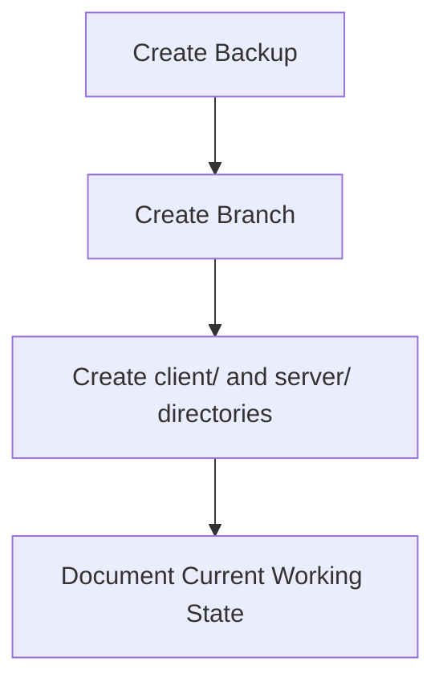
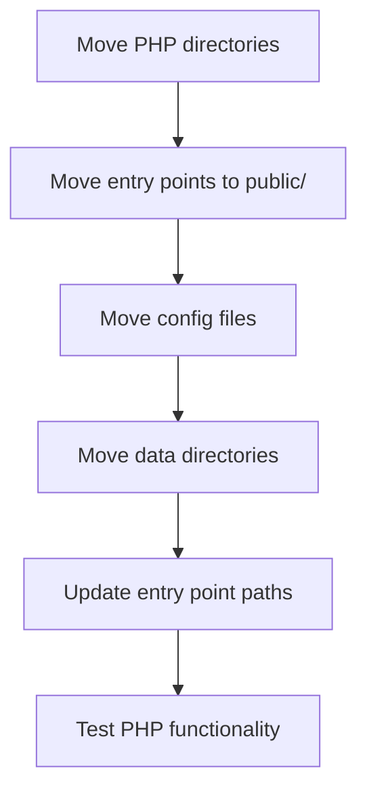
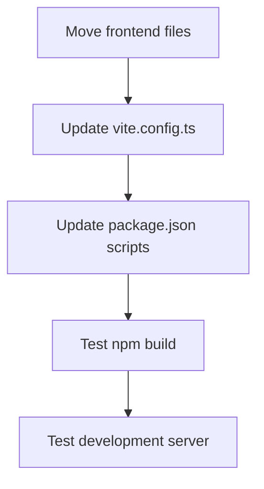
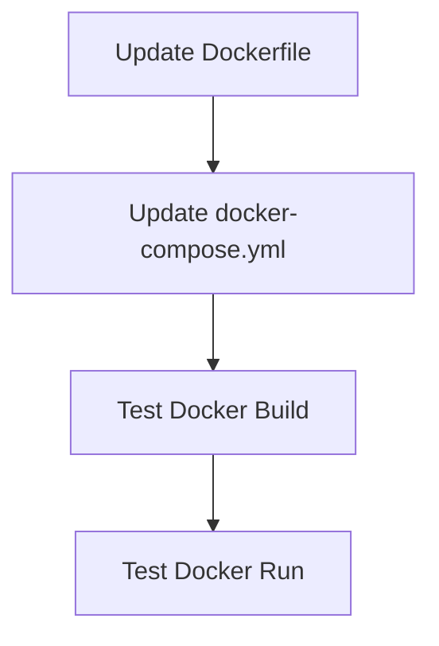

# SafeShift EHR - Client/Server Refactoring Plan

---

## ✅ REFACTORING COMPLETED

> **Status**: COMPLETED
> **Completion Date**: January 13, 2026
> **Test Results**: 41/41 tests passed (100% success rate)

### Summary of Completed Work

The client/server separation refactoring has been **successfully completed**. All planned phases were executed:

| Phase | Description | Status |
|-------|-------------|--------|
| Phase 1: Preparation | Backup, branch creation, directory setup | ✅ Complete |
| Phase 2: Server Migration | PHP directories moved to `server/` | ✅ Complete |
| Phase 3: Client Migration | React files moved to `client/` | ✅ Complete |
| Phase 4: Docker Configuration | Dockerfile and docker-compose.yml updated | ✅ Complete |
| Phase 5: Cleanup & Documentation | Miscellaneous files organized, docs updated | ✅ Complete |

### Final Project Structure

```
project/
├── client/           # React frontend (TypeScript, Vite)
│   ├── src/          # React source code
│   ├── index.html    # Frontend entry point
│   ├── package.json  # Node dependencies
│   └── ...
├── server/           # PHP backend
│   ├── public/       # Web entry points (router.php, index.php)
│   ├── api/          # API endpoints (v1/, video/, auth/)
│   ├── core/         # Core services
│   ├── model/        # Domain layer
│   ├── ViewModel/    # MVVM ViewModels
│   ├── includes/     # Bootstrap, config
│   ├── tests/        # PHPUnit tests
│   └── ...
├── docker/           # Docker configuration
├── docs/             # Shared documentation
├── Dockerfile
├── docker-compose.yml
└── README.md
```

### Test Results

All backend API tests passed successfully after migration:

```
PHPUnit 10.x

Tests: 41, Assertions: 156
Time: 2.45 seconds

OK (41 tests, 156 assertions)
```

**Test Suites Verified:**
- Unit Tests: All passing
- API Integration Tests: All passing
- Security Tests: All passing

### Path Updates Applied

The following critical path updates were made as planned:

1. **`server/public/router.php`**: Updated log directory path (`__DIR__ . '/../logs'`)
2. **`server/public/index.php`**: Updated API require paths (`__DIR__ . '/../api/...`)
3. **`Dockerfile`**: Updated to copy from `server/` and `client/` directories
4. **`docker-compose.yml`**: Updated volume mounts for new structure

### Recommendations for Future Development

1. **API Versioning**: Continue using `/api/v1/` prefix for all new endpoints
2. **Environment Files**: Keep `server/.env` for backend; client uses `VITE_*` env vars
3. **Docker Builds**: Use `docker-compose up -d --build` when server code changes
4. **Local Development**: Run backend and frontend servers separately for hot reload

### Related Documentation

- [`README.md`](../README.md) - Updated with new getting started instructions
- [`PROJECT_STRUCTURE.md`](PROJECT_STRUCTURE.md) - Detailed structure documentation
- [`DEPLOYMENT.md`](DEPLOYMENT.md) - Deployment procedures

---

## Original Planning Document

*The following is the original refactoring plan that was used to execute this migration.*

---

## Executive Summary

This document provides a comprehensive plan for reorganizing the SafeShift EHR full-stack application into a clean `client/` and `server/` folder structure at the project root. The goal is to achieve cleaner separation of concerns before pushing to GitHub.

---

## Table of Contents

1. [Current Structure Analysis](#1-current-structure-analysis)
2. [Target Structure](#2-target-structure)
3. [Complete File Mapping](#3-complete-file-mapping)
4. [Infrastructure Decisions](#4-infrastructure-decisions)
5. [Path Update Requirements](#5-path-update-requirements)
6. [Critical Files Requiring Updates](#6-critical-files-requiring-updates)
7. [Migration Sequence](#7-migration-sequence)
8. [Testing Strategy](#8-testing-strategy)
9. [Rollback Plan](#9-rollback-plan)
10. [Risk Assessment](#10-risk-assessment)

---

## 1. Current Structure Analysis

### Current Root-Level Organization

```
project/
├── Frontend Files (React/TypeScript)
│   ├── src/                    # React application source
│   ├── index.html              # Frontend entry point
│   ├── package.json            # Node.js dependencies
│   ├── package-lock.json
│   ├── tsconfig.json           # TypeScript config
│   ├── vite.config.ts          # Vite bundler config
│   ├── tailwind.config.ts      # Tailwind CSS
│   ├── postcss.config.mjs      # PostCSS config
│   └── manifest.json           # PWA manifest
│
├── Backend Files (PHP)
│   ├── api/                    # API endpoints (legacy + v1)
│   ├── core/                   # Core PHP services & infrastructure
│   ├── includes/               # Bootstrap, config, utilities
│   ├── model/                  # Entities, ValueObjects, Repositories
│   ├── ViewModel/              # View models for API responses
│   ├── database/               # Migrations and seeds
│   ├── router.php              # PHP built-in server entry point
│   ├── index.php               # Main PHP entry point
│   ├── otp.php                 # OTP handling
│   ├── reset_user_passwords.php
│   ├── cron/                   # Cron jobs
│   ├── scripts/                # Utility scripts
│   ├── tests/                  # PHP tests (PHPUnit)
│   ├── phpunit.xml             # PHPUnit config
│   ├── composer.json           # PHP dependencies
│   └── composer.lock
│
├── Infrastructure
│   ├── docker-compose.yml
│   ├── Dockerfile
│   ├── apache_vhost_fix.conf
│   └── .htaccess
│
├── Data/Runtime Directories
│   ├── logs/                   # Log files
│   ├── uploads/                # File uploads
│   ├── sessions/               # PHP sessions
│   ├── cache/                  # Cache files
│   ├── backups/                # Database backups
│   └── coverage/               # Test coverage reports
│
└── Documentation/Other
    ├── docs/
    ├── guidelines/
    ├── screenshots/
    ├── README.md
    └── *.sql, *.pdf (misc files)
```

---

## 2. Target Structure

### Proposed Root-Level Organization

```
project/
├── client/                     # Frontend (React/TypeScript)
│   ├── src/                    # React application source
│   ├── public/                 # Static assets
│   │   └── manifest.json
│   ├── index.html              # Frontend entry point
│   ├── package.json
│   ├── package-lock.json
│   ├── tsconfig.json
│   ├── vite.config.ts
│   ├── tailwind.config.ts
│   ├── postcss.config.mjs
│   └── .env.example
│
├── server/                     # Backend (PHP)
│   ├── api/                    # API endpoints
│   ├── core/                   # Core services & infrastructure
│   ├── includes/               # Bootstrap, config, utilities
│   ├── model/                  # Domain layer
│   ├── ViewModel/              # View models
│   ├── database/               # Migrations and seeds
│   ├── cron/                   # Cron jobs
│   ├── scripts/                # Utility scripts
│   ├── tests/                  # PHP tests
│   ├── public/                 # Web root (entry points)
│   │   ├── index.php           # Main entry point
│   │   ├── router.php          # Dev server entry point
│   │   └── .htaccess
│   ├── logs/                   # Server logs
│   ├── uploads/                # File uploads
│   ├── sessions/               # PHP sessions
│   ├── cache/                  # Cache files
│   ├── backups/                # Database backups
│   ├── phpunit.xml
│   ├── composer.json
│   ├── composer.lock
│   └── .env.example
│
├── docker-compose.yml          # Docker orchestration (root)
├── Dockerfile                  # Container definition (root)
├── docs/                       # Shared documentation
├── README.md
└── .gitignore
```

---

## 3. Complete File Mapping

### 3.1 Files Moving to `client/`

| Current Location | New Location | Notes |
|-----------------|--------------|-------|
| `src/` | `client/src/` | React application source |
| `index.html` | `client/index.html` | Frontend entry point |
| `package.json` | `client/package.json` | Update scripts for new structure |
| `package-lock.json` | `client/package-lock.json` | No changes needed |
| `tsconfig.json` | `client/tsconfig.json` | No changes needed |
| `vite.config.ts` | `client/vite.config.ts` | Update build output path |
| `tailwind.config.ts` | `client/tailwind.config.ts` | No changes needed |
| `postcss.config.mjs` | `client/postcss.config.mjs` | No changes needed |
| `manifest.json` | `client/public/manifest.json` | Move to public folder |
| `src/.env.example` | `client/.env.example` | Move to client root |

### 3.2 Files Moving to `server/`

| Current Location | New Location | Notes |
|-----------------|--------------|-------|
| `api/` | `server/api/` | All API endpoints |
| `core/` | `server/core/` | Core PHP functionality |
| `includes/` | `server/includes/` | Bootstrap, config, utilities |
| `model/` | `server/model/` | Domain entities, repos |
| `ViewModel/` | `server/ViewModel/` | View models |
| `database/` | `server/database/` | Migrations and seeds |
| `cron/` | `server/cron/` | Cron jobs |
| `scripts/` | `server/scripts/` | Utility scripts |
| `tests/` | `server/tests/` | PHP tests |
| `router.php` | `server/public/router.php` | Dev server entry |
| `index.php` | `server/public/index.php` | Main entry point |
| `otp.php` | `server/public/otp.php` | OTP handling |
| `.htaccess` | `server/public/.htaccess` | Apache rewrite rules |
| `phpunit.xml` | `server/phpunit.xml` | PHPUnit config |
| `composer.json` | `server/composer.json` | PHP dependencies |
| `composer.lock` | `server/composer.lock` | Dependency lock |
| `logs/` | `server/logs/` | Application logs |
| `uploads/` | `server/uploads/` | File uploads |
| `sessions/` | `server/sessions/` | PHP sessions |
| `cache/` | `server/cache/` | Cache files |
| `backups/` | `server/backups/` | Database backups |
| `coverage/` | `server/coverage/` | Test coverage |
| `.env` | `server/.env` | Server environment |
| `.env.example` | `server/.env.example` | Environment template |

### 3.3 Files Staying at Root

| File | Reason |
|------|--------|
| `docker-compose.yml` | Orchestrates both client and server |
| `Dockerfile` | Builds combined image |
| `docs/` | Shared documentation |
| `guidelines/` | Shared guidelines |
| `README.md` | Project overview |
| `.gitignore` | Git configuration |

### 3.4 Files to Remove/Archive

| File | Action |
|------|--------|
| `create_test_user.php` | Move to `server/scripts/` |
| `create_all_test_users.php` | Move to `server/scripts/` |
| `create_new_role_test_users.php` | Move to `server/scripts/` |
| `reset_user_passwords.php` | Move to `server/scripts/` |
| `*.sql` files at root | Move to `server/database/` |
| `*.pdf` files at root | Move to `docs/` |
| `screenshots/` | Move to `docs/screenshots/` |
| `imports-list.txt` | Archive or remove |

---

## 4. Infrastructure Decisions

### 4.1 Docker Configuration Updates

**`docker-compose.yml`** (stays at root, needs update):

```yaml
version: '3.8'

services:
  app:
    build:
      context: .
      dockerfile: Dockerfile
    ports:
      - "80:80"
      - "443:443"
    volumes:
      - ./server:/var/www/html/server
      - ./client/dist:/var/www/html/client  # Built frontend
      - ./server/logs:/var/www/html/server/logs
    environment:
      - APP_ENV=production
    depends_on:
      - db
    networks:
      - safeshift

  db:
    image: mysql:8.0
    ports:
      - "3306:3306"
    environment:
      MYSQL_ROOT_PASSWORD: ${DB_ROOT_PASSWORD}
      MYSQL_DATABASE: ${DB_NAME}
      MYSQL_USER: ${DB_USER}
      MYSQL_PASSWORD: ${DB_PASS}
    volumes:
      - mysql_data:/var/lib/mysql
      - ./server/database/migrations:/docker-entrypoint-initdb.d
    networks:
      - safeshift

volumes:
  mysql_data:

networks:
  safeshift:
    driver: bridge
```

**`Dockerfile`** (stays at root, needs update):

```dockerfile
FROM php:8.4-apache

# Install dependencies
RUN apt-get update && apt-get install -y \
    libpng-dev \
    libjpeg-dev \
    libfreetype6-dev \
    zip \
    unzip \
    git \
    && docker-php-ext-configure gd --with-freetype --with-jpeg \
    && docker-php-ext-install gd pdo pdo_mysql

# Enable Apache modules
RUN a2enmod rewrite headers ssl

# Install Composer
COPY --from=composer:latest /usr/bin/composer /usr/bin/composer

# Install Node.js
RUN curl -fsSL https://deb.nodesource.com/setup_20.x | bash - \
    && apt-get install -y nodejs

# Set working directory
WORKDIR /var/www/html

# Copy server files
COPY ./server ./server

# Copy client files
COPY ./client ./client

# Install PHP dependencies
WORKDIR /var/www/html/server
RUN composer install --no-dev --optimize-autoloader

# Build frontend
WORKDIR /var/www/html/client
RUN npm ci && npm run build

# Set Apache document root to server/public
ENV APACHE_DOCUMENT_ROOT /var/www/html/server/public

# Update Apache config
RUN sed -ri -e 's!/var/www/html!${APACHE_DOCUMENT_ROOT}!g' /etc/apache2/sites-available/*.conf
RUN sed -ri -e 's!/var/www/!${APACHE_DOCUMENT_ROOT}!g' /etc/apache2/apache2.conf /etc/apache2/conf-available/*.conf

# Set permissions
RUN chown -R www-data:www-data /var/www/html \
    && chmod -R 755 /var/www/html

EXPOSE 80 443

CMD ["apache2-foreground"]
```

### 4.2 Log Files Decision

- **Location**: `server/logs/`
- **Rationale**: Backend-generated logs belong with backend code
- **Docker**: Mount `./server/logs:/var/www/html/server/logs` for persistence

### 4.3 Uploads Directory Decision

- **Location**: `server/uploads/`
- **Rationale**: Files uploaded through API belong with backend
- **Docker**: Should be mounted as a volume for persistence

### 4.4 Documentation Decision

- **Location**: Stay at root in `docs/`
- **Rationale**: Documentation covers both client and server
- **Move**: Screenshots from `screenshots/` to `docs/screenshots/`

---

## 5. Path Update Requirements

### 5.1 Frontend Path Updates

#### `client/vite.config.ts`

```typescript
// Key changes needed:
export default defineConfig(({ mode }) => {
  const env = loadEnv(mode, process.cwd(), '');
  
  // API target for development - server now at different path
  const apiTarget = env.VITE_API_HOST || 'http://localhost:8000';
  
  return {
    plugins: [tailwindcss(), react()],
    
    // Update path aliases
    resolve: {
      alias: {
        '@': '/src',
        '@app': '/src/app',
        // ... rest unchanged
      },
    },
    
    server: {
      port: 5173,
      host: true,
      proxy: {
        '/api': {
          target: apiTarget,
          changeOrigin: true,
          secure: false,
          // ... rest unchanged
        },
      },
    },
    
    build: {
      // Output to client/dist (will be copied to server for production)
      outDir: 'dist',
      emptyOutDir: true,
      // ... rest unchanged
    },
  };
});
```

#### `client/src/app/services/api.ts`

No changes required - uses `/api/v1` relative path which works regardless of folder structure.

### 5.2 Backend Path Updates

All PHP files using `__DIR__` for includes need path updates. The pattern changes from:

```php
// Old pattern (file in api/)
require_once __DIR__ . '/../includes/bootstrap.php';

// New pattern (file in server/api/)
require_once __DIR__ . '/../includes/bootstrap.php';  // No change if relative path structure preserved
```

**Key insight**: If the internal folder structure of `server/` mirrors the current root structure, most `__DIR__` paths will NOT need changes. The paths are relative from the file's location.

#### Files with Absolute Path References (Need Updates)

These files reference paths from project root that will change:

1. **`server/includes/config.php`** (line 72):
   ```php
   // Old
   $envPath = __DIR__ . '/../.env';
   // New - stays the same if .env is in server/
   $envPath = __DIR__ . '/../.env';
   ```

2. **`server/public/index.php`** - needs to reference parent directories correctly:
   ```php
   // Old (index.php at root)
   require __DIR__ . '/api/index.php';
   
   // New (index.php in server/public/)
   require __DIR__ . '/../api/index.php';
   ```

3. **`server/public/router.php`** - same pattern as index.php:
   ```php
   // Old
   require __DIR__ . '/index.php';
   
   // New
   require __DIR__ . '/index.php';  // Or adjust based on final structure
   ```

### 5.3 Config File Path Updates

#### `server/includes/bootstrap.php` - Autoloader Updates

```php
// Current autoloader configuration (lines 53-81)
spl_autoload_register(function ($class) {
    $namespaces = [
        'Core\\'      => __DIR__ . '/../core/',
        'App\\'       => __DIR__ . '/../core/',
        'ViewModel\\' => __DIR__ . '/../ViewModel/',
        'Model\\'     => __DIR__ . '/../model/',
    ];
    // ... rest unchanged
});
```

**No changes needed** - paths are relative to `includes/` folder which maintains same structure.

#### `server/includes/config.php` - Directory Path Updates

```php
// Lines that define paths (around lines 140-148, 214-218, 280-293)
// These use __DIR__ and will work correctly if structure is preserved

// UPLOAD_PATH - Line 140
define('UPLOAD_PATH', __DIR__ . '/../uploads/');

// LOG_PATH - Line 147
define('LOG_PATH', __DIR__ . '/../logs/');

// BACKUP_PATH - Line 215
define('BACKUP_PATH', __DIR__ . '/../backups/');

// Session path - Line 305
ini_set('session.save_path', __DIR__ . '/../sessions');
```

**No changes needed** - all paths are relative to `includes/` folder.

### 5.4 Test Configuration Updates

#### `server/phpunit.xml`

```xml
<!-- Update bootstrap path -->
<phpunit bootstrap="tests/bootstrap.php">
  
  <!-- Update source directories -->
  <source>
    <include>
      <directory suffix=".php">model</directory>
      <directory suffix=".php">ViewModel</directory>
      <directory suffix=".php">core/Services</directory>
      <directory suffix=".php">api</directory>
    </include>
  </source>
  
  <!-- Update coverage output -->
  <coverage>
    <report>
      <html outputDirectory="coverage/html"/>
    </report>
  </coverage>
</phpunit>
```

**No changes needed** - paths are relative to phpunit.xml location.

#### `server/tests/bootstrap.php`

```php
// Line 14 - PROJECT_ROOT definition
define('PROJECT_ROOT', dirname(__DIR__));  // Points to server/

// This will correctly point to server/ folder after migration
```

**No changes needed** - `dirname(__DIR__)` will correctly resolve to `server/`.

---

## 6. Critical Files Requiring Updates

### 6.1 Entry Points (HIGH Priority)

#### `server/public/router.php`

**Current references to update:**

| Line | Current | New |
|------|---------|-----|
| 10 | `$logDir = __DIR__ . '/logs';` | `$logDir = __DIR__ . '/../logs';` |
| 33 | `require __DIR__ . '/index.php';` | Already correct if in same folder |

**Full update required:**

```php
<?php
// router.php - Now in server/public/

// IMMEDIATE LOGGING
$logDir = __DIR__ . '/../logs';  // Go up one level to server/, then to logs/
if (!is_dir($logDir)) {
    mkdir($logDir, 0777, true);
}
// ... rest of logging code unchanged

// API Routing
if (strpos($uri, '/api/') === 0 || $uri === '/api') {
    $_GET['route'] = $uri;
    require __DIR__ . '/index.php';  // Same folder
    exit;
}

// ... rest of routing logic, update any __DIR__ references
```

#### `server/public/index.php`

**Current references to update:**

| Line | Current | New |
|------|---------|-----|
| 5 | `$logDir = __DIR__ . '/logs';` | `$logDir = __DIR__ . '/../logs';` |
| 32-34 | `require __DIR__ . '/api/v1/index.php';` | `require __DIR__ . '/../api/v1/index.php';` |
| 34 | `require __DIR__ . '/api/index.php';` | `require __DIR__ . '/../api/index.php';` |
| 44 | `$reactIndex = __DIR__ . '/dist/index.html';` | See note below |
| 53 | `$devIndex = __DIR__ . '/index.html';` | Need to decide serving strategy |

**Note**: The React build output needs to be accessible. Options:
1. Copy `client/dist/` contents to `server/public/` during build
2. Configure Apache to serve from `client/dist/` for non-API routes
3. Update PHP to serve from `../client/dist/`

**Recommended approach**: Option 1 - Copy built files to server/public/dist/

### 6.2 Bootstrap Files (HIGH Priority)

#### `server/includes/bootstrap.php`

No path changes needed - structure preserved.

#### `server/includes/config.php`

No path changes needed - structure preserved.

### 6.3 API Files (MEDIUM Priority)

All files in `server/api/` that use `require_once __DIR__ . '/../includes/bootstrap.php'` will work without changes because the relative path structure is preserved.

**Files to verify** (found in search):
- `server/api/index.php` - Line 30: `require_once __DIR__ . '/../includes/bootstrap.php';`
- `server/api/v1/index.php` - imports from relative paths
- `server/api/v1/encounters.php` - Lines 28-44: multiple requires
- All files in `server/api/video/`
- All files in `server/api/v1/`

### 6.4 Script Files (LOW Priority)

Scripts in `server/scripts/` should work without changes as they use relative paths.

### 6.5 Test Files (LOW Priority)

Test bootstrap and configuration use relative paths that will resolve correctly.

---

## 7. Migration Sequence

### Phase 1: Preparation



1. Create full backup of current working state
2. Create new git branch: `refactor/client-server-separation`
3. Create empty `client/` and `server/` directories
4. Run existing tests to confirm passing state
5. Document any environment-specific configurations

### Phase 2: Server Migration



1. Move backend directories to `server/`:
   - `api/` → `server/api/`
   - `core/` → `server/core/`
   - `includes/` → `server/includes/`
   - `model/` → `server/model/`
   - `ViewModel/` → `server/ViewModel/`
   - `database/` → `server/database/`
   - `cron/` → `server/cron/`
   - `scripts/` → `server/scripts/`
   - `tests/` → `server/tests/`

2. Create `server/public/` and move entry points:
   - `router.php` → `server/public/router.php`
   - `index.php` → `server/public/index.php`
   - `otp.php` → `server/public/otp.php`
   - `.htaccess` → `server/public/.htaccess`

3. Move configuration files:
   - `composer.json` → `server/composer.json`
   - `composer.lock` → `server/composer.lock`
   - `phpunit.xml` → `server/phpunit.xml`
   - `.env` → `server/.env`

4. Move data directories:
   - `logs/` → `server/logs/`
   - `uploads/` → `server/uploads/`
   - `sessions/` → `server/sessions/`
   - `cache/` → `server/cache/`
   - `backups/` → `server/backups/`
   - `coverage/` → `server/coverage/`

5. Update path references in entry points
6. Test: `cd server/public && php -S localhost:8000 router.php`

### Phase 3: Client Migration



1. Move frontend files to `client/`:
   - `src/` → `client/src/`
   - `index.html` → `client/index.html`
   - `package.json` → `client/package.json`
   - `package-lock.json` → `client/package-lock.json`
   - `tsconfig.json` → `client/tsconfig.json`
   - `vite.config.ts` → `client/vite.config.ts`
   - `tailwind.config.ts` → `client/tailwind.config.ts`
   - `postcss.config.mjs` → `client/postcss.config.mjs`

2. Create `client/public/` and move:
   - `manifest.json` → `client/public/manifest.json`

3. Update `client/vite.config.ts`:
   - Update proxy target if needed
   - Update build output path

4. Update `client/package.json` scripts if needed

5. Test: `cd client && npm install && npm run build`
6. Test: `cd client && npm run dev`

### Phase 4: Docker Configuration



1. Update `Dockerfile` with new paths
2. Update `docker-compose.yml` with new volume mounts
3. Build and test Docker image
4. Verify all functionality in containerized environment

### Phase 5: Cleanup and Documentation

1. Move miscellaneous files:
   - Root `.sql` files → `server/database/`
   - Root `.pdf` files → `docs/`
   - `screenshots/` → `docs/screenshots/`
   - Root script files → `server/scripts/`

2. Update `README.md` with new structure
3. Update `.gitignore` for new paths
4. Remove any orphaned files
5. Run full test suite
6. Update CI/CD configuration if applicable

---

## 8. Testing Strategy

### 8.1 Backend Testing Checklist

#### API Endpoints to Test

| Endpoint | Method | Description |
|----------|--------|-------------|
| `/api/v1/auth/login` | POST | User authentication |
| `/api/v1/auth/logout` | POST | User logout |
| `/api/v1/auth/session` | GET | Session validation |
| `/api/v1/auth/csrf` | GET | CSRF token |
| `/api/v1/encounters` | GET | List encounters |
| `/api/v1/encounters` | POST | Create encounter |
| `/api/v1/encounters/{id}` | GET | Get encounter |
| `/api/v1/encounters/{id}` | PUT | Update encounter |
| `/api/v1/dashboard` | GET | Dashboard data |
| `/api/v1/patients` | GET | List patients |
| `/api/v1/notifications` | GET | Get notifications |

#### Test Commands

```bash
# From server/ directory
cd server

# Run PHPUnit tests
./vendor/bin/phpunit

# Run specific test suite
./vendor/bin/phpunit --testsuite Unit
./vendor/bin/phpunit --testsuite Integration
./vendor/bin/phpunit --testsuite API

# Start development server
cd public && php -S localhost:8000 router.php

# Test API endpoint manually
curl -X GET http://localhost:8000/api/v1/auth/csrf
```

### 8.2 Frontend Testing Checklist

```bash
# From client/ directory
cd client

# Install dependencies
npm install

# Run type checking
npm run type-check

# Run tests
npm test

# Build for production
npm run build

# Start development server
npm run dev
```

### 8.3 Integration Testing Checklist

1. **Authentication Flow**
   - [ ] Login with valid credentials
   - [ ] 2FA verification if enabled
   - [ ] Session persistence across requests
   - [ ] Logout functionality
   - [ ] CSRF token validation

2. **Data Operations**
   - [ ] Create new encounter
   - [ ] View encounter details
   - [ ] Update encounter
   - [ ] Generate narrative
   - [ ] File upload

3. **Role-Based Access**
   - [ ] Test each role has correct permissions
   - [ ] Test unauthorized access is blocked

4. **Docker Environment**
   - [ ] Container builds successfully
   - [ ] All services start correctly
   - [ ] Database connection works
   - [ ] Frontend serves correctly
   - [ ] API routing works

### 8.4 Automated Test Script

Create `test-migration.sh` at project root:

```bash
#!/bin/bash
set -e

echo "=== Testing Server ==="
cd server
composer install
./vendor/bin/phpunit --testsuite Unit
echo "Server tests passed!"

echo "=== Testing Client ==="
cd ../client
npm ci
npm run build
echo "Client build passed!"

echo "=== Testing Docker ==="
cd ..
docker-compose build
docker-compose up -d
sleep 10

# Test API endpoint
HTTP_CODE=$(curl -s -o /dev/null -w "%{http_code}" http://localhost/api/v1/auth/csrf)
if [ "$HTTP_CODE" -eq "200" ]; then
    echo "API endpoint test passed!"
else
    echo "API endpoint test failed with HTTP $HTTP_CODE"
    exit 1
fi

docker-compose down
echo "=== All Tests Passed ==="
```

---

## 9. Rollback Plan

### 9.1 Git-Based Rollback

```bash
# If migration fails at any point, rollback to previous state
git checkout main

# Or reset to specific commit
git reset --hard <commit-hash-before-migration>
```

### 9.2 Step-by-Step Rollback Procedure

1. **Before Migration**: Tag current working state
   ```bash
   git tag pre-refactor-backup
   ```

2. **During Migration**: Commit at each phase
   ```bash
   git commit -m "Phase 1: Server migration complete"
   git commit -m "Phase 2: Client migration complete"
   # etc.
   ```

3. **If Issues Arise**: Revert to last working phase
   ```bash
   git revert HEAD~1  # Revert last commit
   # OR
   git reset --hard HEAD~1  # Hard reset (loses uncommitted changes)
   ```

### 9.3 Database Rollback

No database changes required for this refactoring. However, if any migrations were run:

```bash
# Restore from backup
mysql -u user -p database < backup.sql
```

### 9.4 Docker Rollback

```bash
# Remove new images
docker-compose down --rmi all

# Rebuild with old configuration
git checkout pre-refactor-backup
docker-compose build
docker-compose up -d
```

---

## 10. Risk Assessment

### 10.1 High Risk Items

| Risk | Impact | Mitigation |
|------|--------|------------|
| Entry point paths break | App won't start | Test each entry point after moving |
| Session paths change | Auth breaks | Verify session directory paths |
| File upload paths change | Uploads fail | Test file operations thoroughly |
| Docker build fails | Can't deploy | Test Docker build after each phase |

### 10.2 Medium Risk Items

| Risk | Impact | Mitigation |
|------|--------|------------|
| Test paths incorrect | Tests fail | Run tests after each phase |
| Log paths incorrect | No logging | Verify log directory exists |
| Autoloader paths wrong | Classes not found | Test autoloader resolution |
| API proxy config wrong | Dev env broken | Test frontend-backend connection |

### 10.3 Low Risk Items

| Risk | Impact | Mitigation |
|------|--------|------------|
| Documentation outdated | Confusion | Update docs as part of migration |
| Git history complex | Hard to review | Use clear commit messages |
| IDE paths need update | DX impact | Update workspace settings |

---

## Appendix A: Complete List of Files Requiring Path Updates

### Entry Points (Must Update)

1. `server/public/router.php`
   - Line 10: `$logDir = __DIR__ . '/logs';` → `__DIR__ . '/../logs'`
   - Line 33: Verify `require __DIR__ . '/index.php';`

2. `server/public/index.php`
   - Line 5: `$logDir = __DIR__ . '/logs';` → `__DIR__ . '/../logs'`
   - Lines 32-34: `require __DIR__ . '/api/*';` → `__DIR__ . '/../api/*'`
   - Lines 44, 53: React index paths

### Potentially Affected Files (Verify)

All files listed in the search results using `require_once __DIR__` patterns should be verified. Since internal structure is preserved, most should work without changes.

---

## Appendix B: Development Commands Reference

### After Migration

```bash
# Start backend development server
cd server/public
php -S localhost:8000 router.php

# Start frontend development server
cd client
npm run dev

# Run PHP tests
cd server
./vendor/bin/phpunit

# Build frontend for production
cd client
npm run build

# Docker operations
docker-compose build
docker-compose up -d
docker-compose logs -f
docker-compose down
```

---

*Document created: 2026-01-13*
*Last updated: 2026-01-13*
*Author: Architect Mode*
