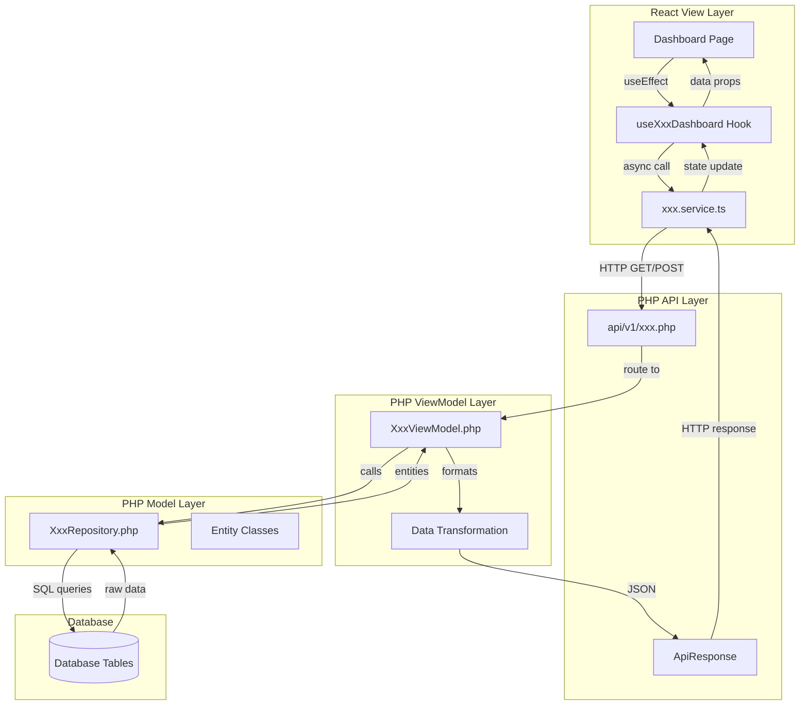

# Vertical Slice Architecture for Dashboard Implementation

## Overview

This document defines the vertical slice architecture for implementing each dashboard type in the SafeShift EHR system. Each vertical slice follows the pattern:

**View (React) → API (PHP) → ViewModel (PHP) → Repository (PHP) → Database**

The architecture ensures:
- Single API call per dashboard section (no duplicate calls)
- Clear separation of concerns between layers
- Consistent patterns across all dashboards
- Reusable shared utilities

---

## Architecture Pattern Diagram



---

## Layer Responsibilities

### 1. View Layer (React)

| Component | Responsibility |
|-----------|----------------|
| **Dashboard Page** | UI rendering, user interactions, state display |
| **Custom Hook** | Data fetching, state management, loading/error handling |
| **Service** | HTTP calls, request/response transformation |

### 2. API Layer (PHP)

| Component | Responsibility |
|-----------|----------------|
| **Router File** | Route parsing, method dispatch, error handling |
| **ApiResponse** | Standardized JSON response formatting |

### 3. ViewModel Layer (PHP)

| Component | Responsibility |
|-----------|----------------|
| **ViewModel Class** | Business logic, data aggregation, response shaping |
| **BaseViewModel** | Authentication, authorization, common utilities |

### 4. Model Layer (PHP)

| Component | Responsibility |
|-----------|----------------|
| **Repository** | Database queries, data access, entity mapping |
| **Entity** | Data structure, validation, serialization |

---

## High Priority Dashboard Slices

### 1. ClinicalProvider Dashboard

**Role:** `pclinician` (Clinical Provider)  
**Route:** `/dashboard/provider`  
**Current Status:** Minimal integration (mock data arrays)

#### 1.1 Data Requirements

| Data Section | Database Tables | Key Fields |
|--------------|-----------------|------------|
| Provider Stats | `encounters`, `encounter_observations` | status counts, completion metrics |
| Active Encounters | `encounters`, `patients` | encounter_id, patient_id, status, chief_complaint |
| Recent Encounters | `encounters`, `patients` | completed encounters, timestamps |
| Open Cases | `encounters` | assigned provider, pending status |

**SQL Queries:**

```sql
-- Provider statistics
SELECT 
    COUNT(CASE WHEN status = 'in_progress' THEN 1 END) AS in_progress,
    COUNT(CASE WHEN status = 'pending_review' THEN 1 END) AS pending_review,
    COUNT(CASE WHEN status = 'completed' AND DATE(discharged_on) = CURDATE() THEN 1 END) AS completed_today,
    COUNT(CASE WHEN DATE(occurred_on) = CURDATE() THEN 1 END) AS total_today
FROM encounters
WHERE npi_provider = :provider_npi
AND deleted_at IS NULL;

-- Active encounters for provider
SELECT 
    e.encounter_id,
    e.status,
    e.occurred_on,
    e.chief_complaint,
    e.encounter_type,
    p.patient_id,
    p.legal_first_name,
    p.legal_last_name,
    p.dob
FROM encounters e
JOIN patients p ON e.patient_id = p.patient_id
WHERE e.npi_provider = :provider_npi
AND e.status IN ('arrived', 'in_progress')
AND e.deleted_at IS NULL
AND p.deleted_at IS NULL
ORDER BY e.occurred_on DESC
LIMIT 20;
```

#### 1.2 ViewModel Transformation

```php
// ClinicianViewModel.php - getProviderDashboard()
return [
    'stats' => [
        'inProgress' => (int)$stats['in_progress'],
        'pendingReview' => (int)$stats['pending_review'],
        'completedToday' => (int)$stats['completed_today'],
        'todaysTotal' => (int)$stats['total_today'],
    ],
    'activeEncounters' => array_map(fn($e) => [
        'id' => $e['encounter_id'],
        'patientId' => $e['patient_id'],
        'patientName' => $e['legal_first_name'] . ' ' . $e['legal_last_name'],
        'dob' => $e['dob'],
        'status' => $e['status'],
        'chiefComplaint' => $e['chief_complaint'],
        'encounterType' => $e['encounter_type'],
        'occurredOn' => $e['occurred_on'],
    ], $encounters),
    'recentEncounters' => [...],
];
```

#### 1.3 API Endpoint Specification

| Endpoint | Method | Description |
|----------|--------|-------------|
| `/api/v1/dashboard/provider` | GET | Get provider dashboard |
| `/api/v1/dashboard/provider/encounters` | GET | Get paginated encounters |
| `/api/v1/dashboard/provider/patients/:id` | GET | Get patient summary |

**Request/Response:**

```typescript
// GET /api/v1/dashboard/provider
// Response:
{
    "success": true,
    "data": {
        "stats": {
            "inProgress": number,
            "pendingReview": number,
            "completedToday": number,
            "todaysTotal": number
        },
        "activeEncounters": [
            {
                "id": string,
                "patientId": string,
                "patientName": string,
                "dob": string,
                "status": string,
                "chiefComplaint": string,
                "encounterType": string,
                "occurredOn": string
            }
        ],
        "recentEncounters": [...]
    }
}
```

#### 1.4 View Data Loading

```typescript
// useClinicalProviderDashboard.ts
export function useClinicalProviderDashboard() {
    const [data, setData] = useState<ProviderDashboardData | null>(null);
    const [loading, setLoading] = useState(true);
    const [error, setError] = useState<string | null>(null);

    const fetchDashboard = useCallback(async () => {
        setLoading(true);
        setError(null);
        try {
            const response = await getProviderDashboard();
            setData(response);
        } catch (err) {
            setError(err instanceof Error ? err.message : 'Failed to load');
        } finally {
            setLoading(false);
        }
    }, []);

    useEffect(() => {
        fetchDashboard();
    }, [fetchDashboard]);

    return { data, loading, error, refetch: fetchDashboard };
}
```

**Trigger Points:**
- Initial mount: `useEffect` with empty dependency array
- Manual refresh: User clicks refresh button
- Poll interval: Optional 5-minute refresh for active encounters

---

### 2. Registration Dashboard

**Role:** `1clinician` (Intake Clinician)  
**Route:** `/dashboard/registration`  
**Current Status:** No API integration (all mock data)

#### 2.1 Data Requirements

| Data Section | Database Tables | Key Fields |
|--------------|-----------------|------------|
| Queue Stats | `appointments`, `encounters` | pending count, checked-in count |
| Pending Queue | `appointments`, `patients` | scheduled appointments not checked in |
| Recently Completed | `encounters`, `patients` | today's completed registrations |
| Quick Stats | `patients`, `encounters` | total patients, daily counts |

**SQL Queries:**

```sql
-- Registration queue statistics
SELECT 
    COUNT(CASE WHEN a.status = 'scheduled' THEN 1 END) AS scheduled,
    COUNT(CASE WHEN a.status = 'checked_in' THEN 1 END) AS checked_in,
    COUNT(CASE WHEN a.status = 'completed' AND DATE(a.appointment_time) = CURDATE() THEN 1 END) AS completed_today
FROM appointments a
WHERE DATE(a.appointment_time) = CURDATE()
AND a.clinic_id = :clinic_id;

-- Pending registrations queue
SELECT 
    a.appointment_id,
    a.appointment_time,
    a.appointment_type,
    a.status,
    p.patient_id,
    p.legal_first_name,
    p.legal_last_name,
    p.dob,
    p.phone,
    e.employer_name
FROM appointments a
JOIN patients p ON a.patient_id = p.patient_id
LEFT JOIN (
    SELECT patient_id, employer_name 
    FROM encounters 
    WHERE deleted_at IS NULL 
    ORDER BY created_at DESC LIMIT 1
) e ON p.patient_id = e.patient_id
WHERE a.status = 'scheduled'
AND DATE(a.appointment_time) = CURDATE()
AND a.clinic_id = :clinic_id
ORDER BY a.appointment_time ASC;

-- Total patient count
SELECT COUNT(*) FROM patients WHERE deleted_at IS NULL;
```

#### 2.2 ViewModel Transformation

```php
// RegistrationViewModel.php - getRegistrationDashboard()
return [
    'stats' => [
        'pendingQueue' => (int)$stats['scheduled'],
        'checkedIn' => (int)$stats['checked_in'],
        'completedToday' => (int)$stats['completed_today'],
        'totalPatients' => (int)$totalPatients,
    ],
    'pendingRegistrations' => array_map(fn($a) => [
        'id' => $a['appointment_id'],
        'patientName' => $a['legal_first_name'] . ' ' . $a['legal_last_name'],
        'patientId' => $a['patient_id'],
        'appointmentTime' => $a['appointment_time'],
        'appointmentType' => $a['appointment_type'],
        'employer' => $a['employer_name'] ?? 'Not specified',
        'phone' => $a['phone'],
        'dob' => $a['dob'],
    ], $pending),
    'recentlyCompleted' => [...],
];
```

#### 2.3 API Endpoint Specification

| Endpoint | Method | Description |
|----------|--------|-------------|
| `/api/v1/dashboard/registration` | GET | Get registration dashboard |
| `/api/v1/registration/check-in/:appointmentId` | POST | Check in patient |
| `/api/v1/patients/search` | GET | Search patients |
| `/api/v1/patients` | POST | Create new patient |

**Response Structure:**

```typescript
// GET /api/v1/dashboard/registration
{
    "success": true,
    "data": {
        "stats": {
            "pendingQueue": number,
            "checkedIn": number,
            "completedToday": number,
            "totalPatients": number
        },
        "pendingRegistrations": [
            {
                "id": string,
                "patientName": string,
                "patientId": string,
                "appointmentTime": string,
                "appointmentType": string,
                "employer": string,
                "phone": string,
                "dob": string
            }
        ],
        "recentlyCompleted": [...]
    }
}
```

#### 2.4 View Data Loading

```typescript
// useRegistrationDashboard.ts (enhance existing)
export function useRegistrationDashboard() {
    // Trigger: Initial mount
    // Trigger: After check-in action
    // Trigger: After new patient creation
    // Poll interval: 30 seconds for queue updates
}
```

---

### 3. PrivacyOfficer Dashboard

**Role:** `PrivacyOfficer`  
**Route:** `/dashboard/privacy`  
**Current Status:** No API integration (all mock data)

#### 3.1 Data Requirements

| Data Section | Database Tables | Key Fields |
|--------------|-----------------|------------|
| Compliance Stats | `compliance_kpi_values`, `audit_log` | compliance rate, PHI access count |
| PHI Access Log | `audit_log`, `patient_access_log`, `user` | access events, user details |
| Consent Status | `consents`, `patients` | consent records, expiring consents |
| Regulatory Updates | `regulatory_updates` | pending updates, new regulations |
| Training Compliance | `staff_training_records`, `training_requirements` | privacy training completion |

**SQL Queries:**

```sql
-- Compliance KPI summary
SELECT 
    kpi.kpi_name,
    kpv.value,
    kpv.target_value,
    ROUND((kpv.value / kpv.target_value) * 100, 1) AS compliance_percent
FROM compliance_kpis kpi
JOIN compliance_kpi_values kpv ON kpi.kpi_id = kpv.kpi_id
WHERE kpi.category = 'privacy'
ORDER BY kpv.measured_at DESC;

-- PHI access summary (last 30 days)
SELECT 
    DATE(al.logged_at) AS access_date,
    al.action,
    COUNT(*) AS access_count,
    COUNT(DISTINCT al.user_id) AS unique_users
FROM audit_log al
WHERE al.table_name IN ('patients', 'encounters', 'encounter_observations')
AND al.logged_at >= DATE_SUB(NOW(), INTERVAL 30 DAY)
GROUP BY DATE(al.logged_at), al.action
ORDER BY access_date DESC;

-- Pending regulatory updates
SELECT 
    update_id,
    title,
    description,
    regulation_type,
    effective_date,
    status,
    created_at
FROM regulatory_updates
WHERE status IN ('new', 'pending_review')
ORDER BY effective_date ASC;

-- Privacy training compliance
SELECT 
    COUNT(DISTINCT str.user_id) AS total_assigned,
    SUM(CASE WHEN str.completion_date IS NOT NULL THEN 1 ELSE 0 END) AS completed,
    SUM(CASE WHEN str.expiration_date <= DATE_ADD(NOW(), INTERVAL 30 DAY) THEN 1 ELSE 0 END) AS expiring
FROM staff_training_records str
JOIN training_requirements tr ON str.requirement_id = tr.requirement_id
WHERE tr.training_name LIKE '%privacy%' OR tr.training_name LIKE '%HIPAA%';
```

#### 3.2 ViewModel Transformation

```php
// PrivacyOfficerViewModel.php - getDashboard()
return [
    'stats' => [
        'complianceRate' => $this->calculateComplianceRate($kpis),
        'phiAccessToday' => (int)$accessStats['today_count'],
        'pendingUpdates' => count($pendingUpdates),
        'activeTrainings' => (int)$trainingStats['active_count'],
    ],
    'phiAccessSummary' => $this->formatAccessSummary($accessLog),
    'pendingUpdates' => array_map(fn($u) => [
        'id' => $u['update_id'],
        'title' => $u['title'],
        'type' => $u['regulation_type'],
        'effectiveDate' => $u['effective_date'],
        'status' => $u['status'],
    ], $pendingUpdates),
    'trainingCompliance' => [
        'total' => (int)$trainingStats['total_assigned'],
        'completed' => (int)$trainingStats['completed'],
        'expiring' => (int)$trainingStats['expiring'],
        'compliancePercent' => $this->calculatePercent(
            $trainingStats['completed'],
            $trainingStats['total_assigned']
        ),
    ],
];
```

#### 3.3 API Endpoint Specification

| Endpoint | Method | Description |
|----------|--------|-------------|
| `/api/v1/privacy/dashboard` | GET | Get privacy officer dashboard |
| `/api/v1/privacy/audit-logs` | GET | Get detailed audit logs |
| `/api/v1/privacy/audit-logs/export` | POST | Export audit logs |
| `/api/v1/privacy/consents` | GET | Get consent records |
| `/api/v1/privacy/regulatory-updates/:id/acknowledge` | PUT | Acknowledge update |

**New API Router: `api/v1/privacy.php`**

```php
function handlePrivacyRoute(string $subPath, string $method): void {
    // Route: GET /privacy/dashboard
    // Route: GET /privacy/audit-logs
    // Route: POST /privacy/audit-logs/export
    // Route: GET /privacy/consents
    // Route: PUT /privacy/regulatory-updates/:id/acknowledge
}
```

#### 3.4 View Data Loading

```typescript
// usePrivacyOfficerDashboard.ts (NEW)
export function usePrivacyOfficerDashboard() {
    // Initial load: Dashboard stats + pending updates
    // Lazy load: Detailed audit logs on tab switch
    // Refresh: Manual refresh button
}
```

---

### 4. SecurityOfficer Dashboard

**Role:** `SecurityOfficer`  
**Route:** `/dashboard/security`  
**Current Status:** No API integration (all mock data)

#### 4.1 Data Requirements

| Data Section | Database Tables | Key Fields |
|--------------|-----------------|------------|
| Security Stats | `audit_log`, `auditevent`, `user` | event counts, active users |
| Audit Events | `audit_log`, `auditevent`, `user` | recent events, user context |
| Anomalies | `audit_log` | flagged events, unusual patterns |
| User Sessions | `user`, session data | active sessions, login attempts |
| Device Registry | `user_device` | registered devices |

**SQL Queries:**

```sql
-- Security dashboard statistics
SELECT 
    (SELECT COUNT(*) FROM audit_log WHERE DATE(logged_at) = CURDATE()) AS events_today,
    (SELECT COUNT(*) FROM audit_log WHERE action = 'failed_login' AND DATE(logged_at) = CURDATE()) AS failed_logins_today,
    (SELECT COUNT(DISTINCT user_id) FROM audit_log WHERE DATE(logged_at) = CURDATE()) AS active_users_today,
    (SELECT COUNT(*) FROM user WHERE status = 'active' AND lockout_until IS NULL) AS active_accounts;

-- Recent audit events with user context
SELECT 
    al.log_id,
    al.action,
    al.table_name,
    al.logged_at,
    al.ip_address,
    al.user_agent,
    al.context,
    u.username,
    u.email
FROM audit_log al
LEFT JOIN user u ON al.user_id = u.user_id
ORDER BY al.logged_at DESC
LIMIT 50;

-- Security anomalies (simplified pattern detection)
SELECT 
    al.log_id,
    al.action,
    al.user_id,
    u.username,
    al.ip_address,
    al.logged_at,
    'Unusual activity pattern' AS anomaly_type
FROM audit_log al
LEFT JOIN user u ON al.user_id = u.user_id
WHERE al.action IN ('failed_login', 'export', 'bulk_delete')
AND al.logged_at >= DATE_SUB(NOW(), INTERVAL 24 HOUR)
ORDER BY al.logged_at DESC;

-- MFA status overview
SELECT 
    COUNT(*) AS total_users,
    SUM(CASE WHEN mfa_enabled = 1 THEN 1 ELSE 0 END) AS mfa_enabled,
    SUM(CASE WHEN lockout_until IS NOT NULL AND lockout_until > NOW() THEN 1 ELSE 0 END) AS locked_accounts
FROM user
WHERE is_active = 1;
```

#### 4.2 ViewModel Transformation

```php
// SecurityOfficerViewModel.php - getDashboard()
return [
    'stats' => [
        'systemStatus' => $this->determineSystemStatus($securityMetrics),
        'eventsToday' => (int)$stats['events_today'],
        'anomaliesDetected' => count($anomalies),
        'activeUsers' => (int)$stats['active_users_today'],
        'failedLoginsToday' => (int)$stats['failed_logins_today'],
    ],
    'recentAudits' => array_map(fn($e) => [
        'id' => $e['log_id'],
        'action' => $e['action'],
        'user' => $e['username'] ?? 'System',
        'resource' => $e['table_name'],
        'timestamp' => $e['logged_at'],
        'ipAddress' => $e['ip_address'],
    ], array_slice($auditEvents, 0, 10)),
    'anomalies' => array_map(fn($a) => [
        'id' => $a['log_id'],
        'type' => $a['anomaly_type'],
        'user' => $a['username'] ?? 'Unknown',
        'action' => $a['action'],
        'timestamp' => $a['logged_at'],
    ], $anomalies),
    'mfaStatus' => [
        'totalUsers' => (int)$mfaStats['total_users'],
        'mfaEnabled' => (int)$mfaStats['mfa_enabled'],
        'lockedAccounts' => (int)$mfaStats['locked_accounts'],
    ],
];
```

#### 4.3 API Endpoint Specification

| Endpoint | Method | Description |
|----------|--------|-------------|
| `/api/v1/security/dashboard` | GET | Get security officer dashboard |
| `/api/v1/security/audit-logs` | GET | Get paginated audit logs |
| `/api/v1/security/audit-logs/export` | POST | Export audit logs |
| `/api/v1/security/anomalies` | GET | Get detected anomalies |
| `/api/v1/security/users/:id/unlock` | POST | Unlock user account |
| `/api/v1/security/devices` | GET | Get registered devices |

**New API Router: `api/v1/security.php`**

#### 4.4 View Data Loading

```typescript
// useSecurityOfficerDashboard.ts (NEW)
export function useSecurityOfficerDashboard() {
    // Initial load: All dashboard data
    // Auto-refresh: 60-second interval for real-time monitoring
    // Lazy load: Full audit log on demand
}
```

---

## Medium Priority Dashboard Enhancements

### 5. Admin Dashboard Enhancements

**Role:** `cadmin`, `tadmin`  
**Route:** `/dashboard/admin`  
**Current Status:** Partial integration (hooks exist, fallback data used)

#### 5.1 Missing Data Connections

| Section | Current State | Required Action |
|---------|---------------|-----------------|
| Case Stats | Fallback values | Connect to CaseRepository |
| Compliance Alerts | Mock array | Connect to AdminRepository.getComplianceAlerts() |
| Training Modules | Hook exists | Verify database connection |
| OSHA 300 Log | Hook exists | Verify READ-ONLY enforcement |
| Patient Flow Metrics | Static numbers | Create EncounterMetricsRepository |
| Site Performance | Hardcoded | Create SiteMetricsRepository |
| Provider Performance | Hardcoded | Aggregate from encounters |

#### 5.2 New Repository Methods Needed

```php
// AdminRepository.php - additions
public function getPatientFlowMetrics(string $clinicId, string $dateRange): array;
public function getSitePerformanceMetrics(?string $dateRange = null): array;
public function getProviderPerformanceMetrics(string $clinicId): array;
public function getMoiNoiTrends(string $clinicId, int $months = 6): array;
```

#### 5.3 Enhanced API Endpoints

| Endpoint | Method | Description |
|----------|--------|-------------|
| `/api/v1/admin/metrics/patient-flow` | GET | Patient flow timing metrics |
| `/api/v1/admin/metrics/by-site` | GET | Performance metrics by site |
| `/api/v1/admin/metrics/by-provider` | GET | Performance metrics by provider |
| `/api/v1/admin/metrics/moi-noi` | GET | MOI/NOI trend data |

---

### 6. SuperAdmin Dashboard Enhancements

**Role:** `Admin` (System Administrator)  
**Route:** `/dashboard/super-admin`  
**Current Status:** Partial integration (hooks exist, fallback data used)

#### 6.1 Missing Data Connections

| Section | Current State | Required Action |
|---------|---------------|-----------------|
| System Users | Fallback array | Connect to SuperAdminRepository |
| Clinics | Fallback array | Connect to EstablishmentRepository |
| Security Incidents | Fallback array | Create SecurityIncidentRepository |
| Override Requests | Mock array | Create OverrideRequestRepository |
| Organization Config | Static text | Create SystemConfigRepository |
| Audit Statistics | Fallback numbers | Aggregate from audit_log |

#### 6.2 New Repository Classes Needed

```php
// New: EstablishmentRepository.php
class EstablishmentRepository {
    public function getAllClinics(): array;
    public function getClinicById(string $id): ?array;
    public function getClinicStats(string $clinicId): array;
}

// New: SecurityIncidentRepository.php (or add to existing)
class SecurityIncidentRepository {
    public function getOpenIncidents(): array;
    public function getIncidentStats(): array;
}
```

#### 6.3 Enhanced API Endpoints

| Endpoint | Method | Description |
|----------|--------|-------------|
| `/api/v1/superadmin/organization` | GET | Organization configuration |
| `/api/v1/superadmin/incidents` | GET | Security incidents |
| `/api/v1/superadmin/override-requests` | GET | Pending override requests |
| `/api/v1/superadmin/override-requests/:id` | PUT | Process override request |

---

## Lower Priority Dashboard Implementations

### 7. Doctor Dashboard (Complete Implementation)

**Role:** `doctor` (Medical Doctor)  
**Route:** `/dashboard/doctor`  
**Current Status:** Stub page only

#### 7.1 Functional Requirements

The Doctor dashboard extends the ClinicalProvider dashboard with additional features:
- MRO (Medical Review Officer) verification queue for DOT tests
- Prescription/order signing queue
- Patient chart access
- Telemedicine session management

#### 7.2 Data Requirements

| Data Section | Database Tables | Description |
|--------------|-----------------|-------------|
| MRO Queue | `dot_tests` | Tests requiring MRO review |
| Pending Signatures | `encounter_orders`, `encounters` | Orders awaiting signature |
| Patient Queue | `encounters`, `patients` | Patients assigned to doctor |
| Today's Schedule | `appointments` | Doctor's appointments |

#### 7.3 API Endpoints

| Endpoint | Method | Description |
|----------|--------|-------------|
| `/api/v1/dashboard/doctor` | GET | Get doctor dashboard |
| `/api/v1/doctor/mro-queue` | GET | Get MRO review queue |
| `/api/v1/doctor/mro-queue/:testId/verify` | POST | Complete MRO verification |
| `/api/v1/doctor/orders/:orderId/sign` | POST | Sign order |

---

### 8. SuperManager Dashboard (Complete Implementation)

**Role:** `Manager` (with elevated permissions)  
**Route:** `/dashboard/super-manager`  
**Current Status:** Stub page only

#### 8.1 Functional Requirements

The SuperManager dashboard extends the Manager dashboard with:
- Multi-clinic oversight
- Staff management across locations
- Aggregate reporting
- Role assignment capabilities

#### 8.2 Data Requirements

| Data Section | Database Tables | Description |
|--------------|-----------------|-------------|
| Cross-Clinic Stats | `encounters`, `establishment` | Aggregated clinic metrics |
| Staff Overview | `user`, `userrole` | Staff by clinic |
| Compliance Overview | `compliance_kpi_values` | Cross-clinic compliance |
| Alert Summary | `compliance_alerts` | Aggregated alerts |

#### 8.3 API Endpoints

| Endpoint | Method | Description |
|----------|--------|-------------|
| `/api/v1/dashboard/super-manager` | GET | Get super manager dashboard |
| `/api/v1/manager/clinics` | GET | Get all clinics with stats |
| `/api/v1/manager/staff` | GET | Get staff across clinics |
| `/api/v1/manager/staff/:id/roles` | PUT | Update staff roles |

---

## Notifications Workflow

### 9. Notifications Vertical Slice

**Current Status:** Full API integration (can serve as template)

#### 9.1 Existing Implementation Reference

The notifications system is fully implemented and serves as the reference pattern:

**Database Table:** `user_notification`

**Repository:** `NotificationRepository.php` (if exists, or use direct queries)

**ViewModel Methods:**
- `getNotifications($filters, $page, $perPage)`
- `getUnreadCounts()`
- `markAsRead($notificationId)`
- `markAllAsRead($type)`
- `deleteNotification($notificationId)`

**API Endpoints:** `api/v1/notifications.php`
- `GET /notifications` - List notifications
- `PUT /notifications/:id/read` - Mark as read
- `PUT /notifications/read-all` - Mark all as read
- `DELETE /notifications/:id` - Delete notification

**React Hook:** `useNotifications.ts`
- Auto-refresh every 60 seconds
- Optimistic updates for mark as read
- Pagination support

---

## Shared Utilities and Patterns

### 10. Reusable Components

#### 10.1 PHP Base Classes

```php
// ViewModel/Core/BaseViewModel.php - Already exists
- requireAuth()
- hasPermission($permission)
- getCurrentUserId()
- validateInput($data, $rules)
- paginate($data, $page, $perPage)
- handleException($e)

// ViewModel/Core/ApiResponse.php - Already exists
- success($data)
- error($message, $code)
- validationError($errors)
- notFound($message)
- serverError($message)
```

#### 10.2 TypeScript Base Types

```typescript
// types/dashboard.types.ts (create new)
interface DashboardStats {
    [key: string]: number | string;
}

interface DashboardResponse<T> {
    success: boolean;
    data: T;
    error?: string;
}

interface PaginatedResponse<T> {
    items: T[];
    pagination: {
        page: number;
        perPage: number;
        total: number;
        totalPages: number;
    };
}
```

#### 10.3 Reusable Hook Pattern

```typescript
// hooks/useDashboardData.ts (base pattern)
interface UseDashboardOptions {
    autoRefresh?: boolean;
    refreshInterval?: number;
}

function useDashboardData<T>(
    fetchFn: () => Promise<T>,
    options: UseDashboardOptions = {}
) {
    const [data, setData] = useState<T | null>(null);
    const [loading, setLoading] = useState(true);
    const [error, setError] = useState<string | null>(null);

    const fetch = useCallback(async () => {
        // ... standard fetch logic
    }, [fetchFn]);

    useEffect(() => {
        fetch();
        if (options.autoRefresh && options.refreshInterval) {
            const interval = setInterval(fetch, options.refreshInterval);
            return () => clearInterval(interval);
        }
    }, [fetch, options.autoRefresh, options.refreshInterval]);

    return { data, loading, error, refetch: fetch };
}
```

### 10.4 Loading/Error/Empty States

```typescript
// components/DashboardStates.tsx (create new)
export function LoadingState({ message?: string });
export function ErrorState({ error: string, onRetry?: () => void });
export function EmptyState({ title: string, description?: string });
```

---

## Implementation Order

### Phase 1: High Priority (No Current Integration)

| Order | Dashboard | Effort | Dependencies |
|-------|-----------|--------|--------------|
| 1 | **Registration** | Medium | PatientRepository, AppointmentRepository |
| 2 | **ClinicalProvider** | Medium | EncounterRepository enhancement |
| 3 | **PrivacyOfficer** | High | New PrivacyOfficerViewModel, AuditRepository |
| 4 | **SecurityOfficer** | High | New SecurityOfficerViewModel, AuditRepository |

### Phase 2: Medium Priority (Enhance Existing)

| Order | Dashboard | Effort | Dependencies |
|-------|-----------|--------|--------------|
| 5 | **Admin Enhancements** | Medium | MetricsRepository |
| 6 | **SuperAdmin Enhancements** | Medium | EstablishmentRepository, SystemConfigRepository |

### Phase 3: Lower Priority (Stub Pages)

| Order | Dashboard | Effort | Dependencies |
|-------|-----------|--------|--------------|
| 7 | **Doctor** | Medium | DOT testing integration, MRO workflow |
| 8 | **SuperManager** | Medium | Multi-clinic aggregation |

---

## File Creation Summary

### New PHP Files to Create

```
ViewModel/
├── ClinicianViewModel.php          # Enhance existing
├── RegistrationViewModel.php       # NEW
├── PrivacyOfficerViewModel.php     # NEW
├── SecurityOfficerViewModel.php    # NEW
├── DoctorViewModel.php             # NEW
├── SuperManagerViewModel.php       # NEW

model/Repositories/
├── AppointmentRepository.php       # NEW
├── AuditRepository.php             # NEW
├── EstablishmentRepository.php     # NEW
├── MetricsRepository.php           # NEW

api/v1/
├── privacy.php                     # NEW
├── security.php                    # NEW
├── registration.php                # NEW (or enhance dashboard.php)
```

### New TypeScript Files to Create

```
src/app/
├── services/
│   ├── provider.service.ts         # NEW
│   ├── registration.service.ts     # NEW
│   ├── privacy.service.ts          # NEW
│   ├── security.service.ts         # NEW
│
├── hooks/
│   ├── useClinicalProviderDashboard.ts  # Enhance existing
│   ├── useRegistrationDashboard.ts      # Enhance existing
│   ├── usePrivacyOfficerDashboard.ts    # NEW
│   ├── useSecurityOfficerDashboard.ts   # NEW
│   ├── useDoctorDashboard.ts            # NEW
│   ├── useSuperManagerDashboard.ts      # NEW
│
├── types/
│   └── dashboard.types.ts          # NEW
```

---

## Summary

This vertical slice architecture document defines the complete data flow for each dashboard type:

1. **High Priority Dashboards** (ClinicalProvider, Registration, PrivacyOfficer, SecurityOfficer) require new PHP ViewModels, Repositories, and TypeScript hooks/services.

2. **Medium Priority Dashboards** (Admin, SuperAdmin) need enhancement to remove fallback data and connect to actual database queries.

3. **Lower Priority Dashboards** (Doctor, SuperManager) require complete implementation from scratch.

4. **Shared Patterns** include reusable base classes, standardized response formats, and consistent loading/error states.

The implementation should follow the established patterns from the working examples (Manager, Technician, Notifications dashboards) to ensure consistency across the codebase.
