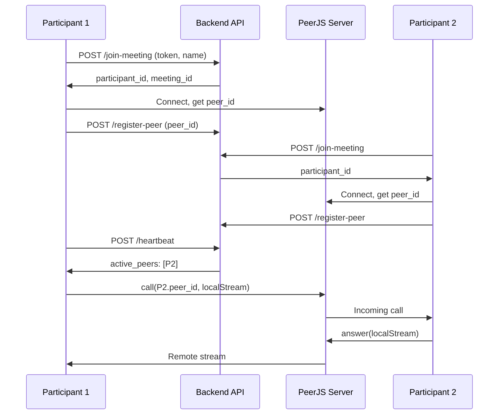

# Video Meeting API Documentation

> WebRTC-based video meeting feature for SafeShift EHR telehealth functionality

**Version:** 1.0.0  
**Last Updated:** 2026-01-11  
**Author:** SafeShift Development Team

---

## Table of Contents

1. [Overview](#1-overview)
2. [Architecture](#2-architecture)
3. [Database Schema](#3-database-schema)
4. [API Endpoints](#4-api-endpoints)
5. [Security](#5-security)
6. [Frontend Components](#6-frontend-components)
7. [WebRTC Implementation](#7-webrtc-implementation)
8. [Logging](#8-logging)
9. [Configuration](#9-configuration)
10. [Deployment Checklist](#10-deployment-checklist)
11. [Troubleshooting](#11-troubleshooting)

---

## 1. Overview

The Video Meeting feature enables secure, HIPAA-compliant telehealth video consultations between clinicians and patients. Built on WebRTC technology with PeerJS for signaling, it provides:

- **Token-based Access**: Secure 64-character tokens for meeting access
- **Role-based Permissions**: Only clinicians can create meetings
- **Real-time Communication**: Peer-to-peer video/audio with fallback support
- **In-meeting Chat**: Persistent chat messages during meetings
- **Audit Logging**: Comprehensive logging for compliance

### Key Features

| Feature | Description |
|---------|-------------|
| Video Calls | 1:1 and multi-party video meetings |
| Screen Sharing | Share screen during meetings |
| Chat | Real-time text chat within meetings |
| Token Links | Shareable links with 24-hour expiration |
| Participant Tracking | Track who joins/leaves meetings |
| Audit Logs | Full event logging for HIPAA compliance |

### Technology Stack

- **Backend**: PHP 8.x with MVVM architecture
- **Frontend**: React 18+ with TypeScript
- **WebRTC**: PeerJS for signaling
- **Database**: MySQL 8.x with InnoDB
- **Security**: Token-based auth, XSS prevention, SQL injection protection

---

## 2. Architecture

### System Architecture Diagram

```
┌─────────────────────────────────────────────────────────────────────────────┐
│                              Client Browser                                  │
├─────────────────────────────────────────────────────────────────────────────┤
│  ┌─────────────────┐  ┌─────────────────┐  ┌─────────────────┐              │
│  │ VideoMeetingPage│  │ video-meeting   │  │ video-signaling │              │
│  │    (React)      │──│   .service.ts   │──│   .service.ts   │              │
│  └─────────────────┘  └─────────────────┘  └─────────────────┘              │
│           │                    │                    │                        │
│           └────────────────────┼────────────────────┘                        │
│                                │                                             │
│                    ┌───────────▼───────────┐                                │
│                    │   webrtc.service.ts   │                                │
│                    │      (PeerJS)         │                                │
│                    └───────────┬───────────┘                                │
└────────────────────────────────┼────────────────────────────────────────────┘
                                 │
                    ┌────────────▼────────────┐
                    │      PeerJS Cloud       │
                    │   (Signaling Server)    │
                    └────────────┬────────────┘
                                 │
┌────────────────────────────────▼────────────────────────────────────────────┐
│                            PHP Backend                                       │
├─────────────────────────────────────────────────────────────────────────────┤
│  ┌─────────────────┐  ┌─────────────────┐  ┌─────────────────┐              │
│  │   API Endpoints │──│ VideoMeeting    │──│ VideoMeeting    │              │
│  │  (api/video/)   │  │   ViewModel     │  │   Repository    │              │
│  └─────────────────┘  └─────────────────┘  └─────────────────┘              │
│           │                    │                    │                        │
│           └────────────────────┼────────────────────┘                        │
│                                │                                             │
│                    ┌───────────▼───────────┐                                │
│                    │     MySQL Database    │                                │
│                    │   (Video Meeting      │                                │
│                    │      Tables)          │                                │
│                    └───────────────────────┘                                │
└─────────────────────────────────────────────────────────────────────────────┘
```

### Component Responsibilities

| Component | Location | Responsibility |
|-----------|----------|----------------|
| API Endpoints | [`api/video/`](../api/video/) | HTTP interface, request validation |
| VideoMeetingViewModel | [`ViewModel/VideoMeetingViewModel.php`](../ViewModel/VideoMeetingViewModel.php) | Business logic, RBAC, token management |
| VideoMeetingRepository | [`model/Repositories/VideoMeetingRepository.php`](../model/Repositories/VideoMeetingRepository.php) | Data persistence, queries |
| Entity Classes | [`model/Entities/`](../model/Entities/) | Domain objects |
| Frontend Services | [`src/app/services/`](../src/app/services/) | API calls, WebRTC management |
| React Components | [`src/app/components/VideoMeeting/`](../src/app/components/VideoMeeting/) | UI components |

---

## 3. Database Schema

### Entity Relationship Diagram

```
┌──────────────────────┐       ┌──────────────────────┐
│       users          │       │    video_meetings    │
├──────────────────────┤       ├──────────────────────┤
│ user_id (PK)         │◄──────│ created_by (FK)      │
│ ...                  │       │ meeting_id (PK)      │
└──────────────────────┘       │ token                │
                               │ token_expires_at     │
                               │ is_active            │
                               │ created_at           │
                               │ ended_at             │
                               └──────────┬───────────┘
                                          │
                    ┌─────────────────────┴─────────────────────┐
                    │                                           │
          ┌─────────▼─────────┐                     ┌───────────▼───────────┐
          │ meeting_participants│                   │  video_meeting_logs   │
          ├───────────────────┤                     ├───────────────────────┤
          │ participant_id (PK)│                    │ log_id (PK)           │
          │ meeting_id (FK)    │                    │ meeting_id (FK)       │
          │ display_name       │                    │ user_id (FK)          │
          │ joined_at          │                    │ log_type              │
          │ left_at            │                    │ action                │
          │ ip_address         │                    │ details (JSON)        │
          │ peer_id            │                    │ ip_address            │
          │ last_heartbeat     │                    │ created_at            │
          └─────────┬──────────┘                    └───────────────────────┘
                    │
          ┌─────────▼─────────┐
          │meeting_chat_messages│
          ├───────────────────┤
          │ message_id (PK)    │
          │ meeting_id (FK)    │
          │ participant_id(FK) │
          │ message_text       │
          │ sent_at            │
          └───────────────────┘
```

### Table: `video_meetings`

Core meeting records with token-based access.

| Column | Type | Nullable | Description |
|--------|------|----------|-------------|
| `meeting_id` | INT UNSIGNED | NO | Primary key, auto-increment |
| `created_by` | INT UNSIGNED | NO | FK to `users.user_id` (clinician) |
| `created_at` | TIMESTAMP | NO | Meeting creation timestamp |
| `token` | VARCHAR(128) | NO | Unique secure token (64 hex chars) |
| `token_expires_at` | TIMESTAMP | NO | Token expiration (24 hours) |
| `is_active` | BOOLEAN | NO | Whether meeting is active |
| `ended_at` | TIMESTAMP | YES | When meeting was ended |

**Indexes:**
- `PRIMARY KEY (meeting_id)`
- `UNIQUE KEY idx_token (token)`
- `INDEX idx_created_by (created_by)`
- `INDEX idx_is_active (is_active)`

### Table: `meeting_participants`

Tracks all participants who join meetings.

| Column | Type | Nullable | Description |
|--------|------|----------|-------------|
| `participant_id` | INT UNSIGNED | NO | Primary key, auto-increment |
| `meeting_id` | INT UNSIGNED | NO | FK to `video_meetings.meeting_id` |
| `display_name` | VARCHAR(100) | NO | Participant's display name |
| `joined_at` | TIMESTAMP | NO | Join timestamp |
| `left_at` | TIMESTAMP | YES | Leave timestamp |
| `ip_address` | VARCHAR(45) | YES | Client IP (IPv6 compatible) |
| `peer_id` | VARCHAR(64) | YES | PeerJS peer ID |
| `last_heartbeat` | TIMESTAMP | YES | Last heartbeat timestamp |

**Indexes:**
- `PRIMARY KEY (participant_id)`
- `INDEX idx_meeting_id (meeting_id)`
- `INDEX idx_peer_id (peer_id)`

### Table: `meeting_chat_messages`

In-meeting chat history.

| Column | Type | Nullable | Description |
|--------|------|----------|-------------|
| `message_id` | INT UNSIGNED | NO | Primary key, auto-increment |
| `meeting_id` | INT UNSIGNED | NO | FK to `video_meetings.meeting_id` |
| `participant_id` | INT UNSIGNED | NO | FK to `meeting_participants.participant_id` |
| `message_text` | TEXT | NO | Message content (max 2000 chars) |
| `sent_at` | TIMESTAMP | NO | Message timestamp |

### Table: `video_meeting_logs`

Comprehensive audit logging.

| Column | Type | Nullable | Description |
|--------|------|----------|-------------|
| `log_id` | INT UNSIGNED | NO | Primary key, auto-increment |
| `log_type` | VARCHAR(50) | NO | Event type (see Log Types section) |
| `meeting_id` | INT UNSIGNED | YES | FK to `video_meetings.meeting_id` |
| `user_id` | INT UNSIGNED | YES | FK to `users.user_id` |
| `action` | VARCHAR(100) | NO | Human-readable action |
| `details` | JSON | YES | Additional event data |
| `ip_address` | VARCHAR(45) | YES | Client IP address |
| `created_at` | TIMESTAMP | NO | Log timestamp |

---

## 4. API Endpoints

### Authentication Requirements

| Endpoint Type | Authentication | Who Can Access |
|---------------|----------------|----------------|
| Provider Endpoints | Session Required | Clinicians only |
| Public Endpoints | None | Anyone with valid token |
| Meeting Endpoints | Participant context | Active participants |

### 4.1 Create Meeting

Creates a new video meeting. **Requires clinician authentication.**

```
POST /api/video/create-meeting.php
```

**Request:**
```http
POST /api/video/create-meeting.php HTTP/1.1
Content-Type: application/json
Cookie: PHPSESSID=xxx

{}
```

**Response (200 OK):**
```json
{
  "success": true,
  "message": "Meeting created successfully",
  "data": {
    "meeting_id": 123,
    "meeting_url": "https://example.com/video/join?token=abc123...",
    "token": "abc123def456789...",
    "expires_at": "2026-01-12T16:00:00Z",
    "is_active": true
  }
}
```

**Error Responses:**

| Status | Error Code | Description |
|--------|------------|-------------|
| 401 | UNAUTHORIZED | Not authenticated |
| 403 | FORBIDDEN | User is not a clinician |
| 500 | SERVER_ERROR | Internal error |

**cURL Example:**
```bash
curl -X POST https://example.com/api/video/create-meeting.php \
  -H "Content-Type: application/json" \
  -H "Cookie: PHPSESSID=your_session_id" \
  -d '{}'
```

### 4.2 Validate Token

Validates a meeting token without joining. **Public endpoint.**

```
GET /api/video/validate-token.php?token={token}
```

**Parameters:**

| Name | Type | Required | Description |
|------|------|----------|-------------|
| `token` | string | Yes | 64-character meeting token |

**Response (200 OK - Valid):**
```json
{
  "success": true,
  "data": {
    "valid": true,
    "meeting_id": 123,
    "can_join": true
  }
}
```

**Response (200 OK - Invalid):**
```json
{
  "success": true,
  "data": {
    "valid": false,
    "error": "Meeting link has expired"
  }
}
```

**cURL Example:**
```bash
curl "https://example.com/api/video/validate-token.php?token=abc123def456..."
```

### 4.3 Join Meeting

Joins a meeting with a display name. **Public endpoint.**

```
POST /api/video/join-meeting.php
```

**Request Body:**
```json
{
  "token": "abc123def456789...",
  "display_name": "John Doe"
}
```

**Validation Rules:**
- `token`: Required, 64 hex characters
- `display_name`: Required, 1-100 characters, sanitized for XSS

**Response (200 OK):**
```json
{
  "success": true,
  "message": "Successfully joined meeting",
  "data": {
    "participant_id": 456,
    "meeting_id": 123,
    "display_name": "John Doe",
    "joined_at": "2026-01-11T16:00:00Z",
    "session_data": {
      "participant_count": 2,
      "meeting_active": true
    }
  }
}
```

**Error Responses:**

| Status | Error Code | Description |
|--------|------------|-------------|
| 400 | BAD_REQUEST | Invalid/expired token |
| 422 | VALIDATION_ERROR | Invalid display name |

**cURL Example:**
```bash
curl -X POST https://example.com/api/video/join-meeting.php \
  -H "Content-Type: application/json" \
  -d '{"token":"abc123...", "display_name":"John Doe"}'
```

### 4.4 Leave Meeting

Records participant departure from meeting.

```
POST /api/video/leave-meeting.php
```

**Request Body:**
```json
{
  "meeting_id": 123,
  "participant_id": 456
}
```

**Response (200 OK):**
```json
{
  "success": true,
  "message": "Left meeting successfully"
}
```

### 4.5 End Meeting

Ends a meeting for all participants. **Host only.**

```
POST /api/video/end-meeting.php
```

**Request Body:**
```json
{
  "meeting_id": 123
}
```

**Response (200 OK):**
```json
{
  "success": true,
  "message": "Meeting ended successfully"
}
```

**Error Responses:**

| Status | Error Code | Description |
|--------|------------|-------------|
| 401 | UNAUTHORIZED | Not authenticated |
| 403 | FORBIDDEN | Not the meeting creator |

### 4.6 Get Meeting Link

Gets the shareable link for a meeting. **Authenticated.**

```
GET /api/video/meeting-link.php?meeting_id={id}
```

**Response:**
```json
{
  "success": true,
  "data": {
    "meeting_id": 123,
    "meeting_url": "https://example.com/video/join?token=abc123...",
    "expires_at": "2026-01-12T16:00:00Z"
  }
}
```

### 4.7 Get My Meetings

Gets meetings created by the authenticated user.

```
GET /api/video/my-meetings.php
```

**Response:**
```json
{
  "success": true,
  "data": {
    "meetings": [
      {
        "meeting_id": 123,
        "created_at": "2026-01-11T12:00:00Z",
        "is_active": true,
        "participant_count": 2,
        "meeting_url": "https://..."
      }
    ]
  }
}
```

### 4.8 Get Participants

Gets participants in a meeting.

```
GET /api/video/participants.php?meeting_id={id}
```

**Response:**
```json
{
  "success": true,
  "data": {
    "participants": [
      {
        "participant_id": 456,
        "display_name": "John Doe",
        "joined_at": "2026-01-11T16:00:00Z",
        "left_at": null
      }
    ]
  }
}
```

### 4.9 Send Chat Message

Sends a chat message in a meeting.

```
POST /api/video/chat-message.php
```

**Request Body:**
```json
{
  "meeting_id": 123,
  "participant_id": 456,
  "message": "Hello everyone!"
}
```

**Validation:**
- `message`: Required, max 2000 characters, sanitized for XSS

**Response:**
```json
{
  "success": true,
  "data": {
    "message_id": 789,
    "meeting_id": 123,
    "participant_id": 456,
    "sent_at": "2026-01-11T16:05:00Z"
  }
}
```

### 4.10 Get Chat History

Gets all chat messages for a meeting.

```
GET /api/video/chat-history.php?meeting_id={id}
```

**Response:**
```json
{
  "success": true,
  "data": {
    "messages": [
      {
        "message_id": 789,
        "participant_id": 456,
        "sender_name": "John Doe",
        "message": "Hello everyone!",
        "sent_at": "2026-01-11T16:05:00Z"
      }
    ]
  }
}
```

### Signaling Endpoints

#### 4.11 Register Peer

Registers a PeerJS peer ID with a participant.

```
POST /api/video/signal/register-peer.php
```

**Request:**
```json
{
  "meeting_id": 123,
  "participant_id": 456,
  "peer_id": "abc123-xyz789"
}
```

**Response:**
```json
{
  "success": true,
  "message": "Peer registered successfully",
  "data": {
    "meeting_id": 123,
    "participant_id": 456,
    "peer_id": "abc123-xyz789"
  }
}
```

#### 4.12 Get Peers

Gets all active peers in a meeting.

```
GET /api/video/signal/get-peers.php?meeting_id={id}
```

**Response:**
```json
{
  "success": true,
  "data": {
    "peers": [
      {
        "participant_id": 456,
        "peer_id": "abc123-xyz789",
        "display_name": "John Doe"
      }
    ]
  }
}
```

#### 4.13 Heartbeat

Keeps participant alive and gets updated peer list.

```
POST /api/video/signal/heartbeat.php
```

**Request:**
```json
{
  "meeting_id": 123,
  "participant_id": 456,
  "peer_id": "abc123-xyz789"
}
```

**Response:**
```json
{
  "success": true,
  "meeting_id": 123,
  "active_peers": [
    {
      "participant_id": 456,
      "peer_id": "abc123-xyz789",
      "display_name": "John Doe"
    }
  ],
  "count": 1
}
```

#### 4.14 Disconnect Peer

Disconnects a peer from the meeting.

```
POST /api/video/signal/disconnect.php
```

**Request:**
```json
{
  "meeting_id": 123,
  "participant_id": 456
}
```

---

## 5. Security

### 5.1 Token System

The token system provides secure, time-limited access to meetings:

- **Token Generation**: Uses `random_bytes(32)` for cryptographic randomness
- **Token Format**: 64 hexadecimal characters (256-bit entropy)
- **Token Expiration**: 24 hours from creation
- **Token Uniqueness**: Verified against database before use

```php
// Token generation (ViewModel/VideoMeetingViewModel.php:83)
public function generateSecureToken(): string
{
    return bin2hex(random_bytes(self::TOKEN_BYTES)); // 32 bytes = 64 hex chars
}
```

### 5.2 Role-Based Access Control (RBAC)

Only clinician roles can create meetings:

| Role | Create Meeting | Join Meeting | End Meeting |
|------|----------------|--------------|-------------|
| `1clinician` | ✅ | ✅ | Own meetings |
| `pclinician` | ✅ | ✅ | Own meetings |
| `dclinician` | ✅ | ✅ | Own meetings |
| `tadmin` | ✅ | ✅ | Any meeting |
| `cadmin` | ✅ | ✅ | Any meeting |
| `Admin` | ✅ | ✅ | Any meeting |
| Guest | ❌ | ✅ (with token) | ❌ |

### 5.3 XSS Prevention

All user input is sanitized before storage and display:

```php
// Display name sanitization (ViewModel/VideoMeetingViewModel.php:694)
private function sanitizeDisplayName(string $displayName): string
{
    $displayName = strip_tags($displayName);
    $displayName = htmlspecialchars($displayName, ENT_QUOTES | ENT_HTML5, 'UTF-8');
    $displayName = trim($displayName);
    return $displayName;
}
```

### 5.4 SQL Injection Prevention

All database queries use prepared statements:

```php
$stmt = $this->pdo->prepare(
    "SELECT * FROM video_meetings WHERE token = :token"
);
$stmt->execute(['token' => $token]);
```

### 5.5 IP Address Logging

Client IP addresses are logged for security auditing with partial masking:

```php
// IPv4: 192.168.1.xxx
// IPv6: 2001:db8:xxxx:xxxx:xxxx
```

### 5.6 Security Headers

All API responses include security headers:

```php
header('Content-Type: application/json; charset=utf-8');
header('X-Content-Type-Options: nosniff');
header('X-Frame-Options: DENY');
```

---

## 6. Frontend Components

### Component Hierarchy

```
VideoMeetingPage
├── VideoDisplay
│   ├── Local video stream
│   └── Remote video streams (grid layout)
├── MeetingControls
│   ├── Audio toggle
│   ├── Video toggle
│   ├── Screen share toggle
│   └── End call button
├── ChatBox
│   ├── Message list
│   └── Message input
├── ParticipantsList
│   └── Participant cards with status
├── ShareLinkModal
├── JoinModal
└── CallTimer
```

### Component Details

#### [`VideoMeetingPage`](../src/app/components/VideoMeeting/VideoMeetingPage.tsx)
Main container component that orchestrates the meeting experience.

**Props:** None (uses route params)

**Key Features:**
- WebRTC support detection
- Meeting state management via `useVideoMeeting` hook
- Sidebar with chat/participants tabs
- Error handling and recovery

#### [`VideoDisplay`](../src/app/components/VideoMeeting/VideoDisplay.tsx)
Renders local and remote video streams in a responsive grid.

**Props:**
```typescript
interface VideoDisplayProps {
  localStream: MediaStream | null;
  remoteStreams: RemoteStream[];
  localVideoEnabled: boolean;
  localDisplayName: string;
}
```

#### [`MeetingControls`](../src/app/components/VideoMeeting/MeetingControls.tsx)
Audio/video controls bar at bottom of meeting.

**Props:**
```typescript
interface MeetingControlsProps {
  mediaState: MediaState;
  onToggleAudio: () => void;
  onToggleVideo: () => void;
  onToggleScreenShare: () => void;
  onEndCall: () => void;
  screenShareSupported: boolean;
}
```

#### [`ChatBox`](../src/app/components/VideoMeeting/ChatBox.tsx)
In-meeting chat with auto-scroll.

**Props:**
```typescript
interface ChatBoxProps {
  messages: ChatMessage[];
  currentParticipantId: number;
  onSendMessage: (message: string) => Promise<void>;
  loading: boolean;
}
```

#### [`ParticipantsList`](../src/app/components/VideoMeeting/ParticipantsList.tsx)
Shows all meeting participants with connection status.

#### [`ShareLinkModal`](../src/app/components/VideoMeeting/ShareLinkModal.tsx)
Modal for copying/sharing meeting link.

#### [`JoinModal`](../src/app/components/VideoMeeting/JoinModal.tsx)
Pre-join modal for entering display name.

#### [`CallTimer`](../src/app/components/VideoMeeting/CallTimer.tsx)
Displays elapsed meeting time.

---

## 7. WebRTC Implementation

### 7.1 PeerJS Integration

The application uses PeerJS for WebRTC signaling:

```typescript
// webrtc.service.ts
import Peer from 'peerjs';

const peer = new Peer(undefined, {
  host: 'peerjs.com',
  secure: true,
  port: 443
});
```

### 7.2 Connection Flow



### 7.3 Heartbeat Mechanism

Participants send heartbeats every 5 seconds:

1. Updates `last_heartbeat` timestamp
2. Returns list of active peers
3. Peers inactive for 30+ seconds are marked as left

### 7.4 Services

#### [`video-meeting.service.ts`](../src/app/services/video-meeting.service.ts)
Handles all API calls for meeting management.

#### [`video-signaling.service.ts`](../src/app/services/video-signaling.service.ts)
Manages peer registration and heartbeat polling.

#### [`webrtc.service.ts`](../src/app/services/webrtc.service.ts)
PeerJS wrapper for WebRTC connections.

---

## 8. Logging

### 8.1 Log Types

| Log Type | Description | Details Logged |
|----------|-------------|----------------|
| `meeting_created` | New meeting created | provider_id, token_expires_at |
| `meeting_ended` | Meeting terminated | ended_by |
| `meeting_create_denied` | Creation denied | user_id, reason |
| `token_validated` | Token validation success | meeting_id |
| `token_validation_failed` | Token validation failed | reason, token_length |
| `participant_joined` | Participant joined | participant_id, display_name, ip_address |
| `participant_left` | Participant left | participant_id |
| `chat_message_sent` | Chat message sent | participant_id, message_length |
| `peer_registered` | PeerJS peer registered | peer_id, display_name |
| `peer_disconnected` | Peer disconnected | participant_id |
| `stale_participants_removed` | Inactive cleanup | count |

### 8.2 Log Storage

Logs are stored in the `video_meeting_logs` table with JSON details:

```sql
INSERT INTO video_meeting_logs (log_type, meeting_id, user_id, action, details, ip_address)
VALUES ('participant_joined', 123, NULL, 'Participant joined: John', 
        '{"participant_id": 456, "display_name": "John"}', '192.168.1.xxx');
```

### 8.3 Querying Logs

```sql
-- Get all events for a meeting
SELECT * FROM video_meeting_logs 
WHERE meeting_id = 123 
ORDER BY created_at;

-- Get security-related events
SELECT * FROM video_meeting_logs 
WHERE log_type IN ('token_validation_failed', 'meeting_create_denied')
ORDER BY created_at DESC;
```

---

## 9. Configuration

### 9.1 Environment Variables

| Variable | Default | Description |
|----------|---------|-------------|
| `APP_BASE_URL` | Auto-detected | Base URL for meeting links |
| `VIDEO_TOKEN_EXPIRY_HOURS` | 24 | Token expiration time |
| `VIDEO_HEARTBEAT_INTERVAL` | 5000 | Heartbeat interval (ms) |
| `VIDEO_STALE_THRESHOLD` | 30 | Seconds before marking participant stale |

### 9.2 ViewModel Constants

```php
// ViewModel/VideoMeetingViewModel.php
const TOKEN_EXPIRY_HOURS = 24;        // Token valid for 24 hours
const TOKEN_BYTES = 32;                // 64 hex characters
const MAX_DISPLAY_NAME_LENGTH = 100;   // Max name length
const MAX_MESSAGE_LENGTH = 2000;       // Max chat message length
const CLINICIAN_ROLE = '1clinician';   // Base clinician role
```

### 9.3 Frontend Configuration

```typescript
// video-signaling.service.ts
const HEARTBEAT_INTERVAL = 5000; // 5 seconds
const PEER_STALE_THRESHOLD = 30; // 30 seconds
```

---

## 10. Deployment Checklist

### Pre-Deployment

- [ ] Database migration completed
- [ ] Environment variables configured
- [ ] HTTPS enabled (required for WebRTC)
- [ ] CORS headers configured for frontend domain
- [ ] PeerJS server accessible (or self-hosted)

### Database Migration

```bash
# Run the migration script
php database/run_video_meetings_migration.php

# Verify tables created
php database/run_video_meetings_migration.php --dry-run
```

### Frontend Build

```bash
# Install dependencies
npm install

# Build for production
npm run build
```

### Post-Deployment Verification

- [ ] Create test meeting as clinician
- [ ] Validate token works in incognito browser
- [ ] Join meeting from second browser
- [ ] Test video/audio streams
- [ ] Test chat functionality
- [ ] Verify logs are being recorded
- [ ] Test meeting end functionality

---

## 11. Troubleshooting

### Common Issues

#### "Unable to create meeting"
**Cause:** User doesn't have clinician role  
**Solution:** Verify user has appropriate role in `user_roles` table

#### "Invalid token format"
**Cause:** Token is not 64 hex characters  
**Solution:** Ensure token is URL-decoded and not truncated

#### "Meeting not found"
**Cause:** Token doesn't match any meeting  
**Solution:** Check if meeting was created and token is correct

#### "Token expired"
**Cause:** Token is older than 24 hours  
**Solution:** Create a new meeting with fresh token

#### "WebRTC connection failed"
**Cause:** Network/firewall blocking WebRTC  
**Solutions:**
1. Ensure HTTPS is enabled
2. Check if TURN servers are needed
3. Verify PeerJS server is accessible

#### "No video/audio"
**Cause:** Browser permissions denied  
**Solution:** User must grant camera/microphone permissions

### Debug Logging

Enable verbose logging in browser console:

```typescript
// In video-signaling.service.ts
const DEBUG = true;
if (DEBUG) console.log('Heartbeat response:', response);
```

### Database Diagnostics

```sql
-- Check recent meetings
SELECT * FROM video_meetings 
ORDER BY created_at DESC 
LIMIT 10;

-- Check participant activity
SELECT p.*, m.is_active 
FROM meeting_participants p
JOIN video_meetings m ON p.meeting_id = m.meeting_id
WHERE p.left_at IS NULL;

-- View recent logs
SELECT * FROM video_meeting_logs 
ORDER BY created_at DESC 
LIMIT 50;
```

---

## Related Documentation

- [Migration Guide](./VIDEO_MEETING_MIGRATION_GUIDE.md)
- [Security Documentation](./SECURITY.md)
- [Testing Guide](./TESTING_GUIDE.md)

---

*Documentation generated for SafeShift EHR Video Meeting Feature v1.0.0*
